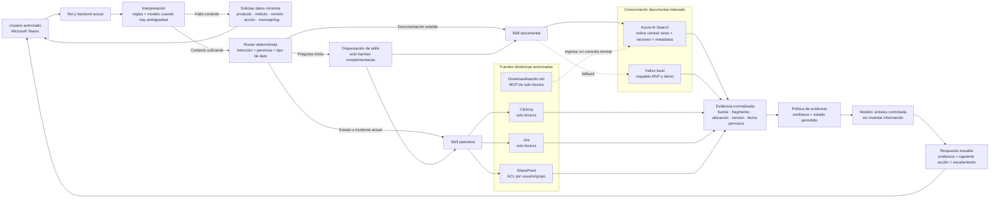
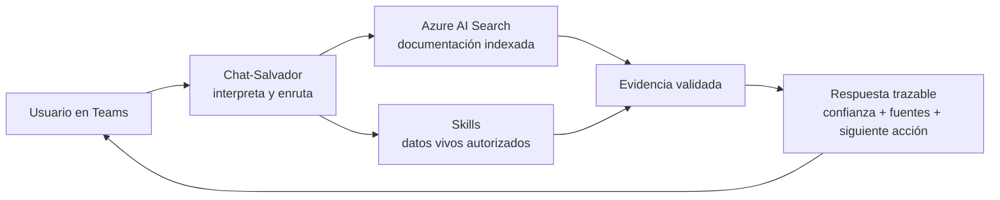
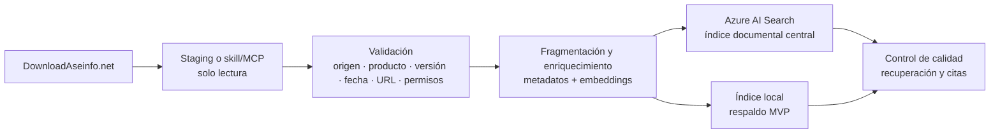

# Arquitectura híbrida de recuperación para Chat-Salvador

## Propósito

Esta propuesta amplía la arquitectura vigente de Chat-Salvador sin sustituir el backend actual ni alterar el flujo de Microsoft Teams. Su objetivo es combinar recuperación documental confiable con consultas dinámicas a sistemas operativos, manteniendo evidencia, permisos y trazabilidad en cada respuesta.

La arquitectura es **híbrida** porque cada componente resuelve una responsabilidad distinta:

- **Azure AI Search** recupera conocimiento documental indexado: manuales, releases, hotfixes y procedimientos.
- **El índice local** conserva una copia de respaldo para desarrollo, demo y continuidad limitada del MVP.
- **Las skills o herramientas del agente** consultan fuentes dinámicas y específicas, como ClickUp, Jira, SharePoint o el MCP de DownloadAseinfo.net.
- **El modelo** interpreta la intención y sintetiza exclusivamente la evidencia recibida; no actúa como motor de búsqueda ni como fuente de verdad.

## Principio de diseño

> El modelo decide qué consulta es necesaria; los proveedores autorizados recuperan la evidencia; la política de evidencia decide qué puede afirmarse.

Las skills no reemplazan a Azure AI Search. Una skill es un adaptador de acceso u orquestación: permite que el agente invoque una API, un MCP o una fuente autorizada. Azure AI Search, en cambio, es el índice documental central: mantiene documentos preparados para búsqueda, metadatos, filtros y recuperación semántica.

## Diagrama de la arquitectura híbrida

## Diagrama resumido

> Azure AI Search recupera el conocimiento documental; las skills consultan datos dinámicos; el bot solo responde cuando la evidencia permite sostener la afirmación.

## Flujo de consulta

1. El usuario formula una pregunta en Teams.
2. El backend interpreta la intención mediante reglas y usa el modelo solo si existe ambigüedad.
3. Si faltan datos críticos, solicita contexto antes de ejecutar consultas amplias.
4. El router selecciona el proveedor mínimo necesario según el tipo de información, los permisos y la actualidad requerida.
5. La skill correspondiente consulta el índice documental o la fuente operativa; no se ejecutan todas las fuentes por defecto.
6. Los resultados se normalizan como evidencia y se evalúan antes de generar la respuesta.
7. El modelo redacta una respuesta en español con estado, confianza, fuentes y siguiente acción. Si no hay respaldo suficiente, escala el caso.

## Responsabilidades por componente

| Componente | Responsabilidad | No debe hacer |
|---|---|---|
| Bot y backend | Recibir la consulta, mantener identidad y coordinar el flujo. | Convertirse en fuente de verdad. |
| Router determinista | Elegir fuentes según intención, permisos y necesidad de actualidad. | Consultar todos los sistemas para cada pregunta. |
| Azure AI Search | Recuperar documentación indexada mediante búsqueda híbrida y filtros de metadatos. | Consultar el estado vivo de un ticket. |
| Índice local | Dar respaldo controlado durante MVP, desarrollo o demo. | Sustituir al índice central a largo plazo. |
| Skills | Invocar fuentes externas autorizadas y combinar pasos de una consulta compleja. | Almacenar conocimiento documental central o decidir afirmaciones sin evidencia. |
| Política de evidencia | Determinar estado y confianza permitidos. | Permitir conclusiones no respaldadas. |
| Modelo | Interpretar ambigüedad y sintetizar evidencia. | Inventar versiones, tickets, causas o soluciones. |

## Routing recomendado

| Caso de usuario | Fuente principal | Participación de la skill | Resultado esperado |
|---|---|---|---|
| Instalación, release, hotfix o versión | Azure AI Search | Ejecuta búsqueda documental con filtros por producto, versión y fecha. | Instrucción oficial y aplicable. |
| Error, incidente o estado actual | ClickUp | Consulta el ticket autorizado en tiempo real. | Estado actual, responsable y siguiente paso, si están disponibles. |
| Antecedente técnico | Jira | Recupera casos históricos relacionados. | Contexto marcado como antecedente, no como solución vigente. |
| Procedimiento corporativo | SharePoint | Consulta respetando ACL del usuario. | Contenido solo si el usuario puede acceder a su origen. |
| Pregunta que mezcla un incidente y una corrección | ClickUp + Azure AI Search | Obtiene estado actual y valida el procedimiento/hotfix en documentación. | Respuesta que distingue el estado del incidente de la guía oficial. |
| Incorporación documental | DownloadAseinfo.net por staging o MCP | Obtiene contenido para el proceso de ingesta. | Documento validado y actualizado en los índices; no una respuesta directa al usuario. |

## Ingesta y actualización documental

El portal DownloadAseinfo.net alimenta el conocimiento documental; no se consulta directamente ante cada mensaje de Teams. La actualización ocurre previamente mediante un flujo controlado.

La ingesta debe rechazar o señalar documentos sin origen verificable, versión o fecha cuando estos datos sean necesarios para su uso. Cada fragmento indexado debe conservar referencia a la ubicación original para que la respuesta sea trazable.

## Reglas operativas y de seguridad

- La búsqueda documental prioriza Azure AI Search; el índice local se usa como respaldo definido, no como una segunda verdad independiente.
- Las consultas a ClickUp, Jira y SharePoint son de solo lectura y deben tener límites de tiempo, manejo de errores y auditoría.
- SharePoint debe aplicar permisos del usuario o grupo antes de recuperar contenido o fragmentos.
- Una fuente dinámica no debe sobrescribir la documentación oficial: un ticket activo informa estado, mientras el documento oficial respalda un procedimiento o versión.
- La respuesta solo puede clasificarse como `resuelto` cuando existe evidencia verificable y aplicable.
- Si una fuente falla, el bot debe informar el límite y continuar solo con las fuentes restantes cuya evidencia sea suficiente.
- No se exponen secretos, contenido restringido ni enlaces que el usuario no pueda abrir.

## Ejemplo: consulta híbrida

**Pregunta:** “¿El error de facturación de la versión 4.2 ya está resuelto y qué hotfix debo aplicar?”

1. El router identifica dos necesidades: estado actual e instrucción de versión.
2. La skill operativa consulta ClickUp para recuperar el ticket activo relacionado con facturación 4.2.
3. La skill documental consulta Azure AI Search con filtros para producto, módulo y versión 4.2.
4. La política de evidencia verifica que el ticket confirme el estado y que el documento oficial describa el hotfix aplicable.
5. El modelo responde diferenciando claramente ambos hallazgos, cita las fuentes y propone la siguiente acción.

Si solo existe el ticket pero no hay documentación oficial del hotfix, el resultado debe quedar como `en_progreso` o `sin_evidencia` para la instrucción técnica; no se debe inferir el procedimiento.

## Resultado esperado del MVP

La arquitectura mantiene el objetivo de un bot prudente y demostrable:

- Teams y el backend actual continúan siendo el punto de entrada.
- Azure AI Search concentra la recuperación documental del MVP.
- El índice local preserva continuidad para demo y desarrollo.
- Las skills conectan de manera selectiva las fuentes vivas y futuras.
- Toda salida visible conserva evidencia, confianza, siguiente acción y escalamiento cuando corresponda.

Para el diagrama de referencia y el detalle de los flujos actuales, consultar [guia-arquitectura-chat-salvador.md](guia-arquitectura-chat-salvador.md).
