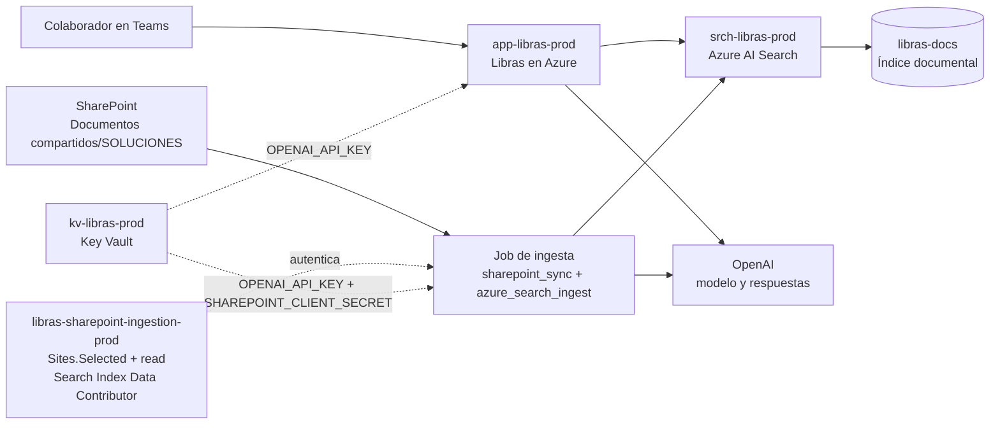

# Arquitectura productiva

Este es el flujo vigente de Libras para producción. La consulta desde Teams y
la ingesta desde SharePoint son caminos separados y usan identidades con
permisos distintos.

## Límites de confianza y permisos

- `app-libras-prod` consulta `libras-docs` con `Search Index Data Reader`.
- El job de ingesta usa la aplicación `libras-sharepoint-ingestion-prod`, con
  `Sites.Selected` y permiso explícito `read` únicamente sobre el sitio
  aprobado. Esa identidad tiene `Search Index Data Contributor` sobre
  `srch-libras-prod`.
- `OPENAI_API_KEY` se referencia desde Key Vault tanto para la aplicación como
  para la ingesta, porque la ingesta genera embeddings.
- `SHAREPOINT_CLIENT_SECRET` se entrega únicamente al job de ingesta; no se
  configura en el App Service que atiende consultas.
- `libras-docs` conserva fragmentos, enlaces y metadatos de origen. Azure AI
  Search es el servicio que contiene el índice; no es una fuente documental
  adicional.

La configuración operativa y los comandos de despliegue están en
[despliegue-produccion.md](despliegue-produccion.md) y la sincronización está
descrita en [azure-ai-search-sharepoint.md](azure-ai-search-sharepoint.md).
