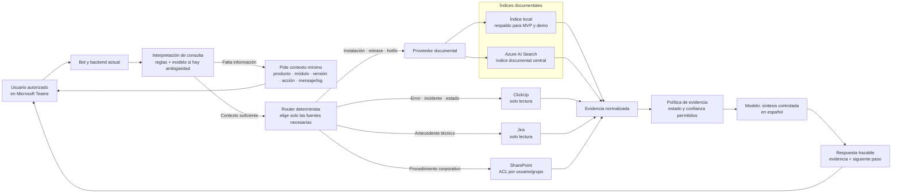
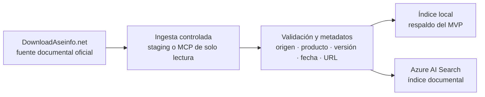

# Guía breve para explicar la arquitectura de Chat-Salvador

## Mensaje central

Chat-Salvador será un bot de Microsoft Teams para soporte y operaciones. Su objetivo es recuperar evidencia de fuentes autorizadas, responder de forma trazable y escalar cuando la información no sea suficiente. No sustituye a desarrollo ni responde por suposición.

## Diagramas de arquitectura

La arquitectura se muestra en dos flujos para no mezclar la actualización de documentos con la atención de una pregunta en Teams.

### 1. Flujo de consulta en Teams

### 2. Flujo de ingesta documental

> La ingesta actualiza los índices antes de la consulta. Cuando el usuario pregunta, el proveedor documental busca en el índice local o en Azure AI Search, no en DownloadAseinfo.net directamente.

## Cómo explicarlo mientras muestras el diagrama

### 1. Punto de entrada

> “El usuario consulta desde Teams. El bot es el punto de entrada, pero no es la fuente de verdad: coordina la búsqueda y presenta una respuesta verificable.”

### 2. Interpretación y contexto

> “Primero se interpreta qué necesita el usuario: instalación, incidente, antecedente o procedimiento. El modelo actúa como intérprete cuando la pregunta es ambigua o incompleta.”

> “Si faltan datos críticos, como producto, módulo, versión, acción o mensaje/log, el bot pregunta antes de buscar. No hace una búsqueda amplia con información insuficiente.”

### 3. Jerarquía de las consultas

> “El router no consulta todos los sistemas a la vez. Selecciona las fuentes según la intención de la pregunta.”

| Tipo de consulta | Fuente principal | Regla de autoridad |
|---|---|---|
| Instalación, release, hotfix o versión | DownloadAseinfo.net, índice local y Azure AI Search | Prevalece el documento oficial de la versión exacta. |
| Error, incidente o estado actual | ClickUp autorizado | Prevalece el ticket activo más reciente y autorizado. |
| Antecedente técnico | Jira autorizado | Se muestra como contexto histórico; no confirma una solución actual por sí solo. |
| Procedimiento corporativo | SharePoint | Solo se usa cuando los permisos del usuario estén validados. |

> “En preguntas mixtas se combinan solo las fuentes que aportan algo distinto. Por ejemplo, ClickUp aporta el estado del incidente y la documentación oficial confirma el hotfix o la versión aplicable.”

> “DownloadAseinfo.net está separado porque alimenta el conocimiento documental. La consulta normal del usuario llega al índice local o a Azure AI Search; no consulta el portal directamente en cada pregunta.”

### 4. Evidencia antes de responder

> “Todas las fuentes devuelven un formato común: fuente, fragmento, enlace o ubicación, versión, fecha y estado cuando exista. Esto permite comparar resultados sin perder trazabilidad.”

> “Antes de redactar, la política de evidencia valida qué puede afirmarse. El modelo resume; no inventa tickets, versiones ni soluciones.”

| Estado posible | Cuándo se permite |
|---|---|
| `resuelto` | Hay una instrucción, corrección o workaround aplicable y verificable. |
| `en_progreso` | Existe un ticket activo autorizado relacionado con el caso. |
| `similar_del_pasado` | Hay un antecedente relacionado, pero no confirmación de que aplique hoy. |
| `sin_evidencia` | Falta información, no hay respaldo suficiente o existe un conflicto. |

### 5. Acceso al bot y acceso al contenido

> “Una persona puede tener acceso al bot en Teams, pero eso no significa que tenga acceso a todos los documentos.”

> “Para SharePoint, el bot debe respetar los permisos que cada usuario ya tiene en el origen. No debe entregar contenido ni fragmentos de documentos que esa persona no pueda abrir directamente.”

### 6. Alcance del MVP

> “El MVP no intenta conectar todo ni resolver cualquier pregunta. Demuestra una experiencia confiable con documentos reales, evidencia visible, respuestas prudentes y una matriz de casos reales.”

- Se conserva Teams y el backend actual.
- El índice local es el respaldo obligatorio para la demostración.
- Azure AI Search y ClickUp mejoran el MVP cuando estén disponibles, sin simular resultados si faltan accesos.
- Jira complementa antecedentes autorizados.
- SharePoint se incorpora después de validar permisos por usuario o grupo.
- No se crean ni modifican tickets, ni se ejecutan scripts o despliegues.

## Cierre sugerido

> “La arquitectura está pensada para priorizar confianza antes que cobertura. Primero entendemos la consulta, buscamos solo en fuentes autorizadas, validamos qué permite afirmar la evidencia y respondemos con un siguiente paso. Si no hay respaldo suficiente, el bot lo dice y escala el caso.”
