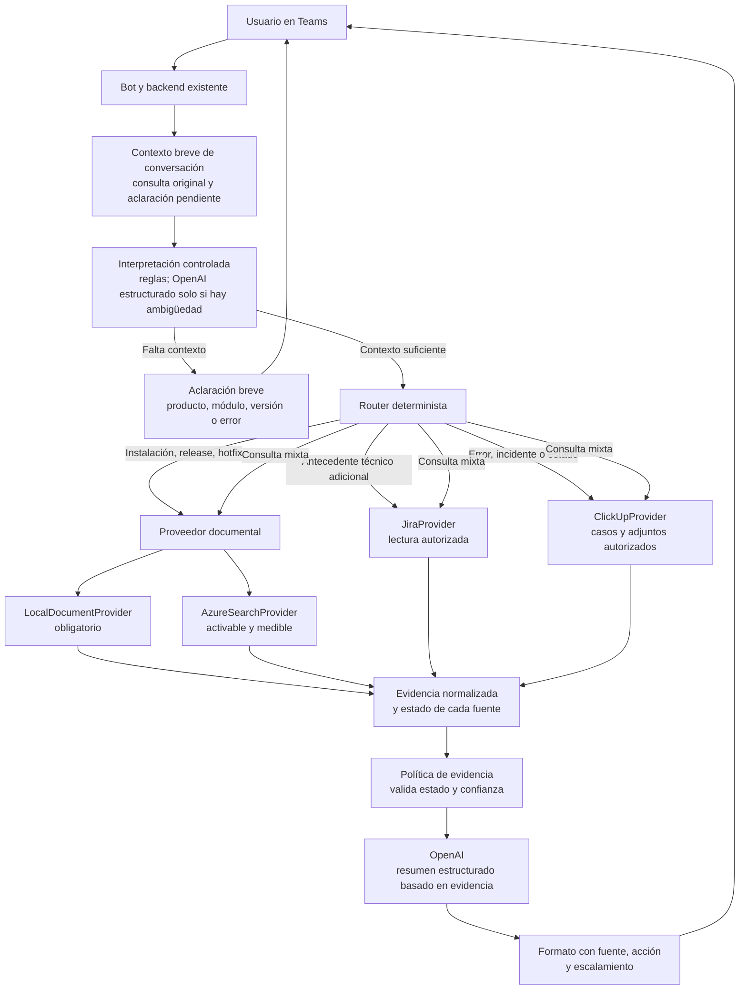

# Mapa único del MVP de Chat-Salvador

> Documento rector para diseñar, revisar, implementar y presentar el MVP de Chat-Salvador.
>
> Este documento reemplaza los planes anteriores. Los demás documentos del repositorio son anexos funcionales, instrucciones operativas o evidencias de estado; no deben crear un roadmap alternativo.

## 0. Control del documento

| Campo | Valor |
|---|---|
| Proyecto | Chat-Salvador |
| Producto | Bot de base de conocimiento para soporte y operaciones |
| Canal inicial | Microsoft Teams |
| Audiencia de revisión | Equipo de soporte, operaciones y desarrollo |
| Hito inmediato | Presentación y retroalimentación del lunes |
| Estado | En diseño y preparación del MVP |
| Documento rector | Este archivo |
| Alcance de esta versión | MVP demostrable, no producto productivo |

### Leyenda de estados

- `Por definir`: falta una decisión funcional o técnica.
- `Pendiente`: la tarea está identificada, pero no se ha ejecutado.
- `En progreso`: existe trabajo activo.
- `Bloqueado`: falta acceso, permiso, información o decisión externa.
- `Validado`: se probó con evidencia real y el resultado fue revisado.
- `Fuera de alcance`: no debe entrar en el MVP del lunes.

### Regla de actualización

Cada cambio importante de alcance, fuente, arquitectura o criterio de aceptación debe actualizarse primero en este documento. Si otro documento contradice este mapa, este documento tiene prioridad.

## 1. Resumen ejecutivo

### Problema

Soporte y operaciones realizan consultas repetitivas al equipo de desarrollo porque la información que necesitan puede estar distribuida entre releases, hotfixes, readmes, changelogs, tickets, repositorios, presentaciones y SharePoint. Además, existen consultas sobre casos que ya están en progreso o sobre asuntos que deberían poder validarse sin interrumpir a otro miembro del equipo.

### Propuesta

Construir un bot en Teams que funcione como un punto de consulta de conocimiento técnico. El bot debe recuperar información de las fuentes que ya existen, presentar evidencia trazable y ser prudente cuando no tenga suficiente respaldo.

### Resultado que se busca demostrar

Una persona puede escribir en Teams una consulta como:

> “Después de instalar el hotfix de nómina el sistema falla al guardar movimientos. ¿Ya está documentado o hay un caso en progreso?”

Y recibir:

- un estado entendible;
- un resumen corto;
- la fuente que respalda la respuesta;
- versión, fecha o ticket cuando existan;
- el siguiente paso recomendado;
- y una indicación clara de cuándo escalar.

### Decisión ejecutiva

Se conserva la base actual del proyecto. No se rehace la integración con Teams ni el flujo principal del backend. Se refactoriza la recuperación de conocimiento para convertirla en un proveedor de evidencia sencillo, con un proveedor local para desarrollo, Azure AI Search para documentación del MVP y conectores operativos opcionales.

Durante el MVP se mantiene OpenAI para generación y estructuración de respuestas. No se migran simultáneamente modelo, búsqueda, conectores y despliegue, porque eso dificultaría aislar los problemas de calidad.

## 2. Auditoría de la base actual

### Componentes existentes que se conservan

- `src/agent.py`: entrada de mensajes y eventos de Teams.
- `src/app.py`: host HTTP del bot.
- `src/handler.py`: orquestación de retrieval, clasificación y formato.
- `src/retrieval.py`: punto actual de recuperación, que será refactorizado.
- `src/document_index.py`: índice local Markdown de respaldo.
- `src/classification.py`: clasificación con OpenAI y reglas locales.
- `src/formatting.py`: respuesta estructurada para el usuario.
- `src/models.py`: modelos internos de evidencia y decisión.
- `src/config.py`: configuración del entorno.
- `infra/`: despliegue base del bot en Azure App Service y Azure Bot.

### Comportamiento actual observado

El backend actual:

1. recibe el mensaje desde Teams;
2. consulta ClickUp si hay credenciales;
3. consulta Jira si hay credenciales;
4. conserva una ruta heredada hacia OpenAI Vector Store, que debe retirarse antes del MVP;
5. usa la base documental local como fallback;
6. clasifica el resultado;
7. formatea una respuesta con fuentes y escalamiento.

### Brechas que el MVP debe resolver

| Brecha actual | Impacto | Tratamiento |
|---|---|---|
| No existe adaptador de DownloadAseinfo.net | No se aprovecha la fuente principal de releases y documentos | P0: definir contrato y preparar staging real; P1: conectar MCP productivo si todavía no está disponible |
| `EvidenceSource` solo tiene cuatro campos | No se puede distinguir bien versión, fecha, fuente o estado | P0: ampliar el modelo |
| `retrieval.py` consulta fuentes de forma fija | Puede aumentar latencia y recuperar resultados irrelevantes | P0: crear `EvidenceProvider` y seleccionar solo las fuentes necesarias |
| OpenAI Vector Store estaba acoplado al retrieval actual | Duplicaba el índice documental y contradecía la arquitectura objetivo | Resuelto: se retiró la ruta y se sustituyó por Azure AI Search con fallback local |
| GitHub solo tiene un importador local de README | No existe exploración MCP del árbol | P1: limitar inicialmente a documentación |
| SharePoint no estaba conectado | No se podía validar todavía el conocimiento corporativo | Conector delegado preparado; pendiente de biblioteca piloto, consentimiento y prueba real |
| Clasificación por reglas usa marcadores débiles | Puede clasificar como resuelto solo por mencionar `hotfix` | P0: exigir evidencia de acción o estado |
| Llamadas externas son síncronas dentro del flujo async | Una fuente lenta puede bloquear la atención del bot | P0/P1: timeout y ejecución no bloqueante |
| No existe conjunto de evaluación formal | No se puede medir mejora de forma reproducible | P0: matriz de preguntas reales |
| La configuración depende de variables específicas | Un entorno incompleto puede fallar al arrancar | P0: validar configuración y mensajes de error |

### Conclusión de la auditoría

La base actual es adecuada para evolucionar. El problema no es el shell de Teams ni la modularidad; el problema es que el retrieval todavía está implementado como una combinación de fuentes concretas y no como una plataforma de evidencia.

### Actualización de implementación — 20 de julio de 2026

- El chat local de Teams se conserva sin cambios de arquitectura.
- `AzureSearchProvider` ya consulta Azure AI Search y el índice local conserva el rol de fallback.
- La ingesta crea fragmentos de Markdown, texto y PDF con URL de origen y puede crear el índice inicial.
- La sincronización de SharePoint usa Microsoft Graph con flujo de dispositivo y permisos delegados; no usa secretos de aplicación ni acceso de administrador.
- Aún faltan el endpoint/rol de Azure AI Search y el consentimiento o acceso a la biblioteca piloto para ejecutar una prueba con PDFs reales.

## 3. Objetivos del MVP

### Objetivo principal

Demostrar que el bot puede responder consultas frecuentes de soporte y operaciones desde Teams usando información real, trazable y actualizable.

### Objetivos funcionales

El MVP debe poder:

1. recibir una pregunta en Teams;
2. identificar aproximadamente el tipo de consulta;
3. consultar la fuente adecuada;
4. recuperar uno o varios fragmentos relevantes;
5. indicar de dónde proviene la información;
6. clasificar el caso;
7. responder con prudencia;
8. escalar cuando la evidencia sea insuficiente;
9. registrar la ruta de investigación sin exponer secretos.

### Objetivos de aprendizaje

La presentación debe permitir al equipo responder:

- ¿Las fuentes existentes contienen información suficiente para comenzar?
- ¿Qué fuentes producen evidencia útil y cuáles no?
- ¿La respuesta del bot es confiable para consultas repetitivas?
- ¿Qué preguntas siguen dependiendo de desarrollo?
- ¿Qué permisos, contratos o procesos de actualización hacen falta?
- ¿Azure AI Search agrega valor respecto al índice actual?

### Hipótesis de valor

> Si el bot puede encontrar documentación o tickets relevantes y mostrar evidencia verificable, soporte y operaciones podrán resolver o enrutar más consultas sin interrumpir directamente al equipo de desarrollo.

Esta hipótesis se valida con preguntas reales, no únicamente con ejemplos preparados.

## 4. Alcance del MVP para el lunes

### Incluido

- Bot conversacional en Teams.
- Respuestas en español.
- Consulta documental de releases, readmes, hotfixes y changelogs.
- Consulta de incidentes de QA y operación en ClickUp, incluyendo coincidencias por mensaje de error, descripción y adjuntos autorizados.
- Consulta de antecedentes históricos en Jira, sobre proyectos autorizados y en modo de solo lectura, cuando aporte contexto adicional.
- Consulta de antecedentes históricos cuando exista evidencia.
- Ingesta o indexación inicial de documentos reales de DownloadAseinfo.net.
- Routing básico por intención.
- Evidencia con fuente, fragmento y ubicación.
- Clasificación en cuatro estados.
- Respuesta `sin_evidencia` con escalamiento.
- Logging técnico básico.
- Matriz de evaluación con preguntas reales.
- Guion de demostración y registro de feedback.

### Incluido de forma limitada

- Azure AI Search: índice documental inicial para el MVP; no sincronización automática completa.
- ClickUp: fuente prioritaria para incidentes reales y estado operativo, en modo de solo lectura y sobre listas autorizadas.
- Jira: fuente complementaria de antecedentes técnicos autorizados; no crea ni modifica tickets.
- DownloadAseinfo.net: fuente documental prioritaria mediante ingestión inicial; el MCP se implementará después de confirmar una API o mecanismo de acceso estable.

### Definición de salida para la demo del lunes

La demo se considera un MVP funcional si demuestra, de punta a punta:

1. una consulta desde Teams;
2. recuperación desde un lote pequeño de documentos reales, aprobados para el grupo piloto;
3. una respuesta con fuente, fragmento y ubicación o enlace verificable;
4. una respuesta prudente de `sin_evidencia` cuando no exista respaldo suficiente; y
5. una matriz reproducible de al menos 8 casos validados.

Azure AI Search, el MCP de DownloadAseinfo.net y ClickUp mejoran la demo, pero no son condiciones de salida si su acceso no está disponible. En ese caso, el proveedor local debe usar el mismo contrato de evidencia, el lote documental debe conservar su procedencia real y el bloqueo debe mostrarse de forma explícita. No se simularán respuestas de fuentes no disponibles.

### Contemplado, pero no obligatorio para la demo

- SharePoint: biblioteca piloto, únicamente si se validan permisos.
- GitHub: commits y diffs únicamente cuando estén vinculados de forma explícita a un ticket Jira `dev-...` y exista autorización.

Todas las fuentes siguen formando parte de la arquitectura evolutiva, pero no todas son condición de salida del MVP.

### Fuera de alcance

- Crear, modificar, cerrar o asignar tickets automáticamente.
- Ejecutar scripts, despliegues o cambios de configuración.
- Explicar todo el código fuente de todos los repositorios.
- Explicar la base de datos sin una fuente específica y autorizada.
- Resolver procesos no documentados mediante inferencias.
- Indexar secretos, archivos de configuración sensibles o repositorios completos sin política de acceso.
- Garantizar sincronización en tiempo real de todas las fuentes.
- Publicar en el tenant oficial antes de un piloto controlado.
- Convertir el bot en un asistente general de la empresa.

## 5. Usuarios, roles y responsabilidades

| Rol | Necesidad | Participación en el MVP |
|---|---|---|
| Soporte | Resolver dudas repetitivas y saber si un caso ya está reportado | Probar consultas reales y calificar utilidad |
| Operaciones | Consultar pasos, advertencias y releases | Validar documentación y claridad de las respuestas |
| Desarrollo | Reducir interrupciones y revisar casos complejos | Validar evidencia, fuentes y reglas de escalamiento |
| Referente funcional (Salvador Arias) | Documentar patrones, validar respuestas y aportar contexto de versiones/configuración | Revisar la matriz inicial, validar casos recurrentes y custodiar correcciones del conocimiento |
| Responsable del producto | Priorizar alcance y aprobar decisiones | Decidir qué entra al MVP y qué queda fuera |
| Responsable de DownloadAseinfo.net | Exponer documentos mediante MCP | Definir contrato, acceso y frescura |
| Administrador Azure/Teams | Habilitar recursos y permisos | Proporcionar entorno dev y configuración segura |
| Responsable de Jira/ClickUp | Confirmar espacios, listas y permisos | Validar consultas de solo lectura |
| Responsable de SharePoint | Seleccionar biblioteca piloto | Confirmar permisos y sensibilidad de documentos |

### Aclaración sobre permisos

Los roles de esta tabla describen participación y necesidades del proyecto; no otorgan permisos automáticamente. Para el MVP se recomienda un grupo piloto y un catálogo documental aprobado. El acceso diferenciado se implementará únicamente cuando la fuente pueda validar permisos por usuario o grupo mediante Teams, Microsoft Entra ID o las ACL propias del sistema.

### Decisiones que requieren responsable

- ¿Cuál será el lote documental inicial?
- ¿Qué lista de ClickUp se puede consultar?
- ¿Qué proyecto de Jira es válido para el MVP?
- ¿Qué repositorios de GitHub pueden explorarse?
- ¿Qué biblioteca de SharePoint está autorizada?
- ¿Quién valida que una respuesta sea técnicamente correcta?
- ¿Quién decide si una pregunta debe entrar al piloto?

## 6. Preguntas prioritarias de evaluación

### Grupo A: documentación de entregas

1. ¿Qué cambió en el release más reciente de un producto?
2. ¿Qué advertencias contiene un hotfix?
3. ¿Qué prerequisito debe cumplirse antes de instalarlo?
4. ¿Existe un workaround documentado para este error?
5. ¿Qué versión está relacionada con este comportamiento?

### Grupo B: casos activos

6. ¿Este problema ya fue reportado?
7. ¿El ticket sigue en progreso?
8. ¿Quién está asignado al caso?
9. ¿Existe una fecha documentada o solo seguimiento?
10. ¿El caso actual coincide con el ticket encontrado?

### Grupo C: antecedentes

11. ¿Este error de Oracle ya ocurrió antes?
12. ¿Existe un caso parecido en otro módulo?
13. ¿Qué solución se aplicó en el antecedente?
14. ¿El antecedente es suficientemente similar para tomarlo como guía?

### Grupo D: límites y escalamiento

15. ¿Esta vista o personalización se puede hacer sin desarrollo?
16. ¿Cuál es el límite técnico documentado?
17. ¿Qué información falta para investigar el caso?
18. ¿No hay evidencia suficiente y debe escalarse?

### Preguntas adversariales

También se deben probar:

- consultas vagas: “no funciona”;
- consultas con errores ortográficos;
- consultas con versiones contradictorias;
- consultas que mezclen dos productos;
- consultas que mencionen un hotfix sin pedir una solución;
- consultas sin ninguna coincidencia;
- consultas sobre información que el usuario no debería ver;
- consultas que pidan una acción no soportada.

### Hallazgos de la llamada con Salvador que deben entrar al MVP

La llamada del 16 de julio (0:03–48:04) debe convertirse en casos de evaluación y reglas del producto:

1. **Error repetitivo:** buscar por mensaje exacto y por variantes; mostrar incidente, versiones afectadas y versión de corrección solo cuando estén documentadas.
2. **Comportamiento sin excepción:** permitir búsqueda por módulo, pantalla, acción y lenguaje humano; si no hay log, clasificar como investigación incompleta y no como error resuelto.
3. **Validación/configuración:** distinguir el mensaje rojo de una falla del sistema. Preguntar por producto, versión, parámetro y configuración antes de sugerir cambios.
4. **Instalación, personalización y estructura:** tratar tablas, procedimientos, campos agregados y parámetros como consultas de contexto avanzado; exigir versión y una fuente autorizada o escalar.
5. **Calidad de evidencia:** priorizar texto y logs (por ejemplo, Elmah) sobre imágenes. Las imágenes pueden conservarse como apoyo de reproducción, pero no deben ser la única evidencia para recuperar o cerrar un caso.
6. **Casos duplicados:** un mismo problema puede existir en incidente, feedback y backlog de Evolution. Se necesita relación canónica entre registros y trazabilidad cuando se mueve o clona un caso.
7. **Conocimiento humano:** Salvador es el referente actual para documentar y ayudar a resolver estas consultas. Debe participar como revisor funcional inicial y como fuente para construir la matriz de preguntas recurrentes.

El MVP debe medir también cuántas consultas repetidas se desvían del referente (la llamada menciona un caso consultado aproximadamente 50 veces) y cuáles continúan requiriendo escalamiento.

## 7. Fuentes de información y estrategia de consulta

### 7.1 DownloadAseinfo.net

#### Propósito

Será la fuente documental principal porque ya contiene releases, readmes, hotfixes, changelogs, PowerPoints y documentos de setup.

#### Modo inicial

- Ingesta controlada de un lote real a staging o Azure AI Search para búsquedas repetibles.
- Investigación de API, endpoint de descarga o mecanismo autorizado y estable antes de construir el MCP.
- MCP de solo lectura para listar y obtener documentos únicamente cuando esa investigación confirme el acceso estable.
- Lectura de metadatos de producto, versión, release y fecha.

#### Autoridad

Alta para instrucciones específicas de una entrega, advertencias y cambios de versión.

#### Requisitos

- identificador estable del archivo;
- nombre y tipo;
- producto;
- versión o release;
- fecha de actualización;
- contenido o descarga;
- URL o ruta de origen;
- indicador de documento vigente, actualizado o eliminado;
- paginación si existen muchos documentos;
- manejo de errores y timeout.

### 7.2 ClickUp

#### Propósito

Consultar incidentes reportados por QA, evidencia técnica, estado de resolución y seguimiento operativo. ClickUp es la fuente principal para determinar si un mensaje de error ya tiene un caso documentado.

#### Modo inicial

- Solo lectura.
- Búsqueda limitada a workspace, espacio o lista autorizada.
- Búsqueda por mensaje de error exacto, síntoma, producto, módulo y versión cuando existan.
- Lectura de título, estado, descripción, fecha, URL y adjuntos de texto autorizados, como logs de Elmah.
- Registrar si la evidencia es texto/log, imagen o solo descripción; una imagen sin texto no debe cerrar un caso ni confirmar una solución.
- Conservar vínculos entre incidente, feedback y backlog cuando representen el mismo problema, junto con un identificador canónico y el historial de movimiento.

#### Autoridad

Alta para el estado operativo actual y para incidentes documentados. Un ticket resuelto puede respaldar una solución solo si indica corrección o workaround concreto, versión aplicable y relación suficiente con la consulta.

#### Reglas

- Una coincidencia de palabras no confirma que sea el mismo caso.
- Una tarea cerrada es antecedente, no solución vigente por defecto; puede ser `resuelto` únicamente si incluye versión corregida o instrucción concreta y coincide el alcance técnico.
- Un adjunto o log confirma el error observado, pero no sustituye la validación de producto, versión, módulo y permisos.
- No mostrar información de listas no autorizadas.
- No prometer fechas si el ticket no las contiene.
- Normalizar al menos `reportado`, `en_investigacion`, `no_se_trabajara`, `resuelto_con_version` y `antecedente`; `resuelto` requiere una acción o versión verificable.

### 7.3 Jira

#### Propósito

Consultar incidentes, bugs, históricos y seguimiento técnico.

#### Modo inicial

- Solo lectura.
- Proyecto o proyectos previamente autorizados.
- Búsqueda por términos, módulo, versión y tipo de issue cuando sea posible.

#### Autoridad

Alta para historial de incidentes y seguimiento técnico, siempre que el estado esté actualizado.

#### Reglas

- El resultado debe incluir clave, resumen, estado, fecha y enlace.
- No presentar un issue histórico como incidente activo sin verificar el estado.
- No exponer descripción o comentarios que el usuario no tenga permiso de ver.
- Limitar la consulta y escapar correctamente los términos usados en la búsqueda.

### 7.4 GitHub

#### Propósito

Explorar estructura de proyectos y recuperar evidencia técnica secundaria.

#### Alcance inicial

- árbol del repositorio;
- README;
- changelog;
- documentación;
- archivos de configuración no sensibles;
- commits o cambios seleccionados cuando sean relevantes.

#### Fuera de alcance inicial

- indexación completa del código;
- explicación automática de toda la base de datos;
- inferir comportamiento solo por nombres de archivos;
- exponer repositorios privados sin validar permisos.

#### Requisitos MCP

- listar repositorios autorizados;
- listar árbol por rama o commit;
- leer archivos concretos;
- devolver rama, commit y fecha;
- devolver URL estable;
- distinguir archivo inexistente de archivo no autorizado.

### 7.5 SharePoint

#### Propósito

Consultar procedimientos, documentación corporativa y material que no esté en DownloadAseinfo.net.

#### Alcance inicial

- una biblioteca piloto;
- grupo pequeño de usuarios;
- validación manual de permisos;
- solo documentos necesarios para la demostración.

#### Riesgo principal

El bot no debe entregar un fragmento de un documento que el usuario no podría abrir directamente. Azure documenta indexación de SharePoint y metadatos de acceso, pero la configuración completa de permisos debe validarse antes de ampliar el alcance.

Referencias:

- [Indexación de SharePoint en Azure AI Search](https://learn.microsoft.com/en-us/azure/search/search-how-to-index-sharepoint-online).
- [Metadatos de control de acceso para SharePoint](https://learn.microsoft.com/en-us/azure/search/search-indexer-sharepoint-access-control-lists).

## 8. Matriz de autoridad, frescura y sensibilidad

| Fuente | Pregunta que responde mejor | Frescura esperada | Sensibilidad esperada | Tratamiento | Prioridad para el lunes |
|---|---|---|---|---|---|
| DownloadAseinfo | Qué se entregó, cómo instalarlo y en qué versión | Por release | Media | Indexar con versión, fecha, tipo de artefacto y URL | P0 principal |
| Azure AI Search | Buscar documentación consolidada | Según sincronización | Depende de documentos | Aplicar filtros y metadatos | P0 principal |
| ClickUp | Incidentes de QA, error exacto, evidencia adjunta y estado actual | Alta | Media/alta | Consulta directa de solo lectura; no indexar el workspace completo | P0 principal |
| Jira | Antecedentes y seguimiento técnico histórico adicional | Media/alta | Media/alta | Consultar solo proyectos autorizados | P0 complementario |
| GitHub | Cómo está organizado o documentado el proyecto | Según commit | Alta en repositorios privados | Limitar a archivos autorizados | P1 posterior |
| SharePoint | Qué procedimiento corporativo existe | Según actualización | Alta | Validar ACL y enlace directo | P1 posterior |

### Regla de conflicto

Cuando dos fuentes difieran:

1. Para estado actual: prevalece el ticket activo más reciente y autorizado.
2. Para instalación: prevalece el documento de la versión exacta consultada.
3. Para historial: prevalece la fuente histórica con mayor contexto y fecha verificable.
4. Para código: el commit o rama deben aparecer en la evidencia.
5. Si el conflicto no puede resolverse, el estado es `sin_evidencia` o `similar_del_pasado`, nunca `resuelto` con confianza alta.

## 9. Arquitectura recomendada para el MVP

### Decisión de arquitectura

La mejor arquitectura para el MVP es un **RAG de evidencia controlado**, no un agente que decide libremente qué herramientas usar. Se conserva la integración de Teams y se organiza el backend existente alrededor de cuatro responsabilidades: entender la consulta, recuperar evidencia, aplicar una política de decisión y comunicar una respuesta verificable.

Para reducir riesgo y cumplir el objetivo de la demo, el MVP usa estas fuentes con responsabilidades separadas:

1. `LocalDocumentProvider` obligatorio: lote pequeño, real y aprobado de documentos de DownloadAseinfo.net. Es la base de la demo y el fallback oficial.
2. `AzureSearchProvider` activable: usa el mismo lote y el mismo contrato de evidencia cuando Azure AI Search esté provisionado. Permite medir si mejora la recuperación, pero no bloquea la salida del MVP.
3. `ClickUpProvider` fundamental: consulta de solo lectura a incidentes de QA y operación autorizados. Busca errores exactos en tareas y adjuntos, devuelve estado, versión corregida, evidencia y enlace. No declara una solución si el producto, versión o flujo no coinciden.
4. `JiraProvider` complementario: consulta de solo lectura al historial técnico autorizado cuando ClickUp no tenga suficiente contexto o cuando el caso haga referencia explícita a Jira. Respalda antecedentes; no confirma por sí solo una solución vigente.

GitHub queda reservado para el análisis técnico acotado de commits y diffs vinculados explícitamente con tickets Jira `dev-...`. SharePoint se incorporará al índice de Azure AI Search después de validar bibliotecas y permisos. OpenAI Vector Store no forma parte de la arquitectura y su código heredado debe retirarse de la ruta de consulta.



### Por qué esta es la recomendación

- Cumple la demostración incluso si Azure AI Search, el MCP o ClickUp no están listos: el proveedor local conserva documentos reales y trazables.
- Evita que una consulta toque todas las fuentes. ClickUp se consulta primero ante un mensaje de error o incidente; Jira se consulta solo cuando aporta antecedente técnico adicional.
- Separa tres tipos de verdad: Downloads Aseinfo respalda entregas oficiales; ClickUp respalda incidentes, logs y estado; Jira respalda antecedentes técnicos adicionales.
- Evita que GPT-4o sea la única barrera contra alucinaciones: el backend valida qué estado permite cada tipo de evidencia antes de mostrarlo.
- Permite comparar el índice local con Azure AI Search usando las mismas preguntas, sin cambiar el resto del bot.
- Mantiene una vía de evolución clara sin convertir la demo en una integración simultánea de múltiples MCPs, repositorios y fuentes corporativas.

### Flujo de ingesta: separado de las consultas

DownloadAseinfo.net alimenta el corpus documental, pero no debe estar en el camino crítico de cada pregunta. El MCP, si está disponible, sirve para obtener documentos y metadatos; si no lo está, se usa staging real controlado. En ambos casos, la consulta del usuario llega al proveedor documental ya preparado.

```text
DownloadAseinfo.net o lote real aprobado
      ↓
MCP de solo lectura o carga controlada
      ↓
Validación de origen, producto, versión, fecha y URL
      ↓
Staging documental en Markdown
      ├── LocalDocumentProvider: obligatorio para demo
      └── AzureSearchProvider: si está provisionado
```

Esta separación significa que una caída del MCP no interrumpe consultas sobre documentos ya incorporados. La fecha de la última ingesta debe mostrarse en la telemetría y, cuando aplique, en la ruta de investigación.

### Política de evidencia antes de generar la respuesta

El modelo puede proponer una clasificación, pero el backend debe validarla con reglas basadas en la fuente y el contenido. La siguiente política es obligatoria para el MVP:

| Estado permitido | Evidencia mínima requerida | Resultado si no se cumple |
|---|---|---|
| `resuelto` | Documento de autoridad con una instrucción, corrección o workaround concreto y aplicable; o ticket ClickUp resuelto con coincidencia de alcance, versión corregida o acción documentada. | `sin_evidencia` o `similar_del_pasado`; nunca resolver solo por el nombre “hotfix” ni por coincidir una excepción. |
| `en_progreso` | Tarea de ClickUp autorizada con estado activo y relación suficiente con la consulta. | `sin_evidencia` o pedir aclaración. |
| `similar_del_pasado` | Documento o tarea cerrada relacionada, sin confirmación de equivalencia. | Mostrarla como antecedente y escalar si se requiere confirmar. |
| `sin_evidencia` | No hay evidencia suficiente, una fuente crítica no está disponible o existe contradicción sin resolver. | Pedir el contexto faltante o escalar. |

La generación no puede cambiar este resultado, agregar hechos ni reemplazar fuentes. Su salida debe validarse contra un esquema con estados y confianza permitidos antes de formatearla para Teams.

### Papel del modelo durante el MVP

OpenAI se usa en dos momentos delimitados:

1. **Interpretación bajo demanda.** Solo cuando las reglas no identifican una intención con confianza suficiente, extrae de la pregunta una estructura como intención, producto, módulo, versión, síntoma y campos faltantes. No invoca proveedores ni elige herramientas.
2. **Síntesis después de recuperar evidencia.** Recibe únicamente la pregunta, la evidencia normalizada y el estado permitido por la política. Produce un resumen breve, siguiente acción y explicación en español.

Si la interpretación devuelve baja confianza o datos críticos faltantes, el bot debe pedir una aclaración breve antes de buscar. Si la síntesis falla o no pasa la validación, el backend debe usar una respuesta determinista y prudente basada en la política de evidencia.

### Contexto mínimo para una aclaración

Pedir una aclaración solo funciona si la siguiente respuesta puede unirse a la consulta original. Para el MVP se debe conservar, por conversación, un contexto breve con la pregunta inicial, los campos faltantes y la aclaración pendiente. La implementación puede aprovechar el `MemoryStorage` existente del agente; no se necesita una nueva base de datos para la demo.

El contexto debe expirar pronto y contener solo lo necesario para completar la consulta. Si el proceso se reinicia, el contexto puede perderse: en ese caso el bot debe pedir que se repita la pregunta con producto, módulo, versión o mensaje de error, en vez de asumir datos previos. Un almacén durable solo será necesario al escalar a múltiples instancias o a producción.

### Componentes y fronteras

| Componente | Responsabilidad en el MVP | No debe hacer |
|---|---|---|
| Teams y `agent.py` | Recibir mensajes y devolver respuestas. | Conocer detalles de índices o fuentes. |
| `ConversationContextStore` | Conservar temporalmente la consulta original y una aclaración pendiente. | Retener información sensible o contexto indefinidamente. |
| `QueryInterpreter` | Extraer intención y contexto; pedir aclaración cuando sea necesario. | Consultar fuentes o generar la respuesta final. |
| `QueryRouter` | Aplicar reglas de selección y límites de consulta. | Dejar la elección de herramientas al modelo. |
| `EvidenceProvider` | Recuperar evidencia y estado de fuente de forma aislada. | Clasificar el caso o redactar para el usuario. |
| `EvidencePolicy` | Deducir estados permitidos y confianza máxima desde la evidencia. | Inventar contenido o ignorar una contradicción. |
| OpenAI | Interpretar ambigüedad y resumir evidencia validada. | Ser fuente de verdad, inventar metadatos o cambiar estados operativos. |
| `formatting.py` | Mostrar la decisión, evidencias, ruta y escalamiento. | Decidir si una evidencia es válida. |

### Escalabilidad sin ampliar el MVP

La interfaz común permite sumar proveedores cuando estén validados, sin cambiar Teams, el router ni la política:

```text
EvidenceProvider
  ├── LocalDocumentProvider     (MVP obligatorio)
  ├── AzureSearchProvider       (MVP activable)
  ├── ClickUpProvider           (MVP fundamental)
  ├── JiraProvider              (MVP complementario)
  ├── GitHubProvider            (posterior)
  └── SharePointProvider        (posterior)
```

Una fuente nueva solo entra después de cumplir siete condiciones: caso de uso concreto, fuente autorizada, contrato de evidencia, regla de permisos, prueba reproducible, criterio de aceptación y decisión explícita de alcance.

## 10. Selección simple de fuentes

El MVP no necesita un router complejo. Basta con seleccionar la fuente principal según el tipo de consulta y utilizar las demás solo como complemento cuando estén disponibles.

### Intenciones iniciales

| Intención | Indicadores | Fuentes principales |
|---|---|---|
| `release_setup` | release, hotfix, instalar, setup, advertencia, prerequisito | DownloadAseinfo, Azure AI Search |
| `operational_status` | reportado, pendiente, en progreso, seguimiento, asignado | ClickUp; Jira si el seguimiento vigente autorizado está allí |
| `incident_error` | mensaje de excepción, Elmah, error al subir, falla, `DbContext`, endpoint | ClickUp primero; complementar con Azure AI Search para confirmar versión o release |
| `historical_case` | antes, histórico, antecedente, ocurrió, Oracle | ClickUp primero si contiene el incidente; Jira como complemento técnico cuando aplique |
| `technical_limit` | se puede, límite, personalización, vista, configuración | Azure AI Search o índice local; escalar si no existe límite documentado |
| `technical_remediation` | cambio, commit, diff, dev-123 | Jira y, solo con una referencia explícita y autorización, GitHub |
| `implementation_question` | cómo funciona, endpoint, clase, tabla, código | Fuera del MVP salvo ticket Jira y repositorio autorizados; de lo contrario, escalar |
| `unknown` | consulta ambigua o sin señales claras | solicitud de contexto; búsqueda documental limitada solo si es segura |

### Interpretación de consultas ambiguas y aclaración progresiva

Una consulta real puede no traer todos los datos necesarios. Por ejemplo, “después de actualizar ya no guarda, ¿se sabe algo?” puede requerir documentación de un hotfix, estado en ClickUp y datos como producto, módulo, versión o mensaje de error.

El usuario no debe tener que aprender un formato rígido ni escribir todos esos datos desde el inicio. El backend debe obtener el contexto de forma progresiva:

```text
Pregunta del usuario
      ↓
Reglas simples detectan una intención clara
      ├── Sí → routing del backend
      └── No o confianza baja → interpretación estructurada con OpenAI
                                      ↓
                         ¿faltan datos críticos?
                              ├── Sí → pregunta breve de aclaración
                              └── No → routing del backend
```

Cuando sea necesario, OpenAI debe producir solo una estructura validable; no debe invocar fuentes ni decidir por su cuenta qué herramienta utilizar. Un resultado esperado tiene este formato conceptual:

```json
{
  "intent": "release_setup | operational_status | historical_case | technical_limit | mixed | unknown",
  "product": "producto si se identificó",
  "module": "módulo si se identificó",
  "version": "versión si se identificó",
  "symptom": "síntoma o mensaje de error resumido",
  "confidence": "alta | media | baja",
  "needs_clarification": true,
  "missing_fields": ["version", "mensaje_de_error"]
}
```

El backend valida los valores permitidos y toma la decisión final:

- intención y confianza suficientes: consulta la fuente definida por las reglas de selección;
- intención mixta: consulta documentación y fuente operativa;
- confianza baja o datos críticos faltantes: pide una aclaración breve, por ejemplo producto, versión, módulo o mensaje exacto del error;
- si el usuario no puede aportar datos y no hay evidencia recuperada: responde `sin_evidencia` y explica el escalamiento.

El propósito de esta fase no es añadir un agente complejo: es evitar búsquedas imprecisas y reducir la necesidad de que la persona usuaria entregue demasiado detalle de entrada.

### Reglas de selección

- No llamar todas las fuentes en cada consulta si la intención permite acotar.
- Usar reglas simples primero; usar OpenAI para extraer intención y contexto estructurado cuando la consulta sea ambigua o incompleta.
- El modelo no llama fuentes ni elige herramientas directamente; el backend valida su salida y aplica el routing.
- Si la consulta pregunta por estado, consultar primero la fuente operativa.
- Si contiene un mensaje de error exacto o un síntoma de incidente, consultar primero ClickUp y sus adjuntos de texto autorizados.
- Si pregunta por instalación o release, consultar primero documentación de entrega.
- Si pide antecedente, consultar ClickUp y complementar con Jira o documentación relacionada cuando corresponda.
- Si solicita explicación de código, endpoint, tabla o base de datos, no consultar fuentes fuera del alcance del MVP: pedir una fuente autorizada o escalar.
- Si la intención es desconocida, pedir primero el dato faltante más útil. Solo hacer una búsqueda documental limitada si esa búsqueda no puede inducir una conclusión incorrecta.
- Si una fuente falla, continuar con las demás y mostrar la dependencia fallida en la ruta de investigación.

## 11. Contrato común de evidencia

### Modelo propuesto

La estructura actual de `EvidenceSource` debe ampliarse. El nombre exacto puede adaptarse al código, pero el concepto debe conservar estos campos:

```json
{
  "source_system": "download | azure_search | clickup | jira | github | sharepoint | local",
  "source_id": "id-estable-de-la-fuente",
  "document_type": "readme | release | setup | hotfix | changelog | ticket | code | procedure",
  "evidence_kind": "text | log | image | description_only",
  "title": "Título visible",
  "url": "https://... o null",
  "location": "ruta, archivo o clave",
  "fragment": "Fragmento exacto o resumido con límite",
  "product": "Producto o null",
  "module": "Módulo o null",
  "version": "Versión o null",
  "affected_versions": ["Versiones afectadas o vacío"],
  "fixed_version": "Versión de corrección o null",
  "release": "Release o null",
  "status": "Estado de ticket/documento o null",
  "canonical_case_id": "Identificador canónico del caso o null",
  "related_source_ids": ["Incidente/feedback/backlog relacionados"],
  "owner": "Responsable o null",
  "created_at": "Fecha o null",
  "updated_at": "Fecha o null",
  "branch": "Rama o null",
  "commit": "Commit o null",
  "access_checked": true,
  "relevance_score": 0.0,
  "authority_score": 0.0,
  "freshness_score": 0.0
}
```

### Campos obligatorios para mostrar una afirmación

Como mínimo, toda evidencia visible debe tener:

- fuente;
- título o identificador;
- fragmento;
- ubicación o enlace.

Versión, fecha, estado y responsable son obligatorios cuando la fuente los proporciona y son relevantes para la consulta.

### Normalización

Todos los adaptadores deben:

- limpiar HTML y formatos irrelevantes;
- limitar el tamaño del fragmento;
- conservar el texto original suficiente para validación;
- normalizar fechas;
- normalizar estados a una representación interna;
- devolver errores como estado técnico, no como evidencia inventada;
- indicar si el contenido es completo o truncado.
- conservar el tipo de evidencia (`text`, `log`, `image` o `description_only`) y si el caso tiene relaciones con otros registros.

## 12. Contrato del proveedor de evidencia

### Interfaz conceptual

Para el MVP se implementan únicamente los proveedores necesarios. Los demás se agregan después sin cambiar el flujo de Teams.

```python
class EvidenceProvider:
    name: str
    mode: str  # indexed | live

    async def search(self, query: str, context: QueryContext) -> SourceResult:
        """Devuelve evidencia, estado de consulta y errores controlados."""

    async def health(self) -> SourceHealth:
        """Indica si el proveedor está configurado y disponible."""
```

### Resultado de fuente

Cada fuente debe devolver conceptualmente:

```json
{
  "source": "clickup",
  "status": "found | no_match | unavailable | unauthorized | timeout | invalid_config",
  "items": [],
  "elapsed_ms": 0,
  "error_code": null,
  "safe_message": null
}
```

El usuario puede ver una explicación general de `unavailable` o `pending_access`, pero nunca detalles de tokens, URLs internas sensibles o excepciones completas.

## 13. Azure AI Search y estrategia de indexación

### Rol de Azure AI Search

Azure AI Search será el índice documental central para contenido estable. Se utilizará para búsqueda textual, vectorial o híbrida según la disponibilidad de embeddings y la configuración del entorno.

La búsqueda híbrida combina consulta textual y vectorial y fusiona resultados; puede complementarse con ranking semántico. Referencias oficiales:

- [Búsqueda híbrida](https://learn.microsoft.com/en-us/azure/search/hybrid-search-overview).
- [Creación de una consulta híbrida](https://learn.microsoft.com/en-us/azure/search/hybrid-search-how-to-query).
- [Conceptos de índices](https://learn.microsoft.com/en-us/azure/search/search-what-is-an-index).

### Qué se indexa primero

1. Releases.
2. Readmes.
3. Hotfixes.
4. Changelogs.
5. Notas de instalación.
6. Presentaciones técnicas convertidas a texto cuando sea posible.
7. Documentación seleccionada de SharePoint, si se validan bibliotecas y permisos. Se ingesta en Azure AI Search, que conserva los metadatos necesarios para aplicar acceso por documento.

Los tickets de ClickUp y sus adjuntos no se copian de forma masiva a Azure AI Search durante el MVP. Se consultan en vivo y solo dentro de las listas autorizadas, porque su estado cambia y pueden contener información sensible. El bot puede combinar un ticket de ClickUp con la documentación indexada de la versión indicada por ese ticket.

### Qué no se indexa primero

- todo el código fuente;
- secretos o archivos `.env`;
- binarios sin extracción de texto;
- documentos sin producto, versión o procedencia cuando esos datos sean necesarios;
- contenido duplicado sin identificador de origen.

### Metadatos mínimos del índice

| Campo | Tipo conceptual | Uso |
|---|---|---|
| `id` | string | Identificador único del chunk |
| `content` | string | Texto recuperable |
| `title` | string | Título visible |
| `source_system` | string | Filtro y trazabilidad |
| `source_id` | string | Referencia al origen |
| `source_url` | string | Enlace al documento |
| `document_type` | string | Priorización |
| `product` | string | Filtro por producto |
| `module` | string | Filtro por módulo |
| `version` | string | Filtro por versión |
| `release` | string | Relación con entrega |
| `updated_at` | datetime | Frescura |
| `status` | string | Estado cuando aplique |
| `acl` | collection/string | Control de acceso, si aplica |
| `content_vector` | vector | Búsqueda vectorial |

### Chunking inicial

La fragmentación debe:

- respetar títulos y secciones;
- evitar separar una instrucción de sus prerequisitos;
- conservar producto, versión y nombre del documento en cada chunk;
- evitar fragmentos demasiado pequeños sin contexto;
- evitar duplicar el mismo párrafo en demasiados chunks;
- incluir metadatos de origen en cada fragmento.

El tamaño exacto se debe validar con consultas reales. No se debe decidir únicamente por una cifra teórica.

### Frescura

Para el MVP se acepta sincronización manual o bajo demanda, siempre que se indique la fecha de la última actualización. La sincronización automática incremental queda en el backlog posterior.

## 14. OpenAI durante el MVP

OpenAI se conserva para:

- extraer intención y contexto estructurado solo cuando la consulta sea ambigua o incompleta;
- redactar un resumen y la respuesta final a partir de evidencia y estado ya validados por el backend;
- devolver una estructura controlada.

El backend, no el modelo, mantiene la autoridad para seleccionar proveedores y determinar qué estado puede sostener la evidencia. Antes de invocar herramientas, una salida de interpretación de baja confianza debe llevar a una pregunta breve de aclaración; no a una búsqueda amplia e imprecisa.

El modelo no debe:

- inventar una fuente;
- crear un ticket inexistente;
- completar una versión faltante;
- convertir una coincidencia semántica en certeza;
- ocultar que la evidencia es antigua o incompleta.
- decidir qué proveedores consultar o invocarlos directamente;
- elevar un estado por encima de lo permitido por la política de evidencia.

Toda salida del modelo debe validarse contra un esquema de intención, estado y confianza permitidos. Si el modelo falla, devuelve datos no válidos o contradice la política de evidencia, el backend debe usar una respuesta determinista y prudente. Si las reglas tampoco tienen evidencia fuerte, el resultado debe ser `sin_evidencia`.

## 15. Estados, confianza y decisión

### `resuelto`

Usar únicamente cuando una fuente contiene una solución, instrucción o workaround aplicable al caso consultado.

Ejemplos de evidencia válida:

- “Antes de instalar la versión X debe ejecutarse el script Y”.
- “El hotfix corrige el error Z en el módulo M”.
- “Si ocurre este error, aplicar el ajuste documentado”.

No es evidencia suficiente:

- que el documento se llame `hotfix`;
- que la consulta contenga la palabra “solución”;
- que un ticket esté cerrado sin explicar el resultado;
- que un documento mencione el mismo producto de forma general.

### `en_progreso`

Usar cuando una fuente operativa autorizada muestra seguimiento activo. La respuesta debe incluir ticket, estado y enlace cuando existan.

### `similar_del_pasado`

Usar cuando hay evidencia histórica o analógica, pero no confirmación de resolución actual ni identidad del caso.

### `sin_evidencia`

Usar cuando:

- no hay coincidencias relevantes;
- la evidencia es demasiado débil;
- las fuentes se contradicen;
- la pregunta pide una capacidad no documentada;
- o no se puede relacionar el resultado con producto, módulo o versión.

La falta de permiso, una fuente caída, un timeout o una configuración incompleta no son equivalentes a “no existen datos”. Si impiden obtener evidencia, el estado de negocio puede ser `sin_evidencia`, pero la respuesta debe declarar la causa en la ruta de investigación: `sin acceso`, `no disponible`, `timeout` o `no configurada`.

### Confianza

| Confianza | Condición sugerida |
|---|---|
| Alta | Fuente primaria, vigente, específica y con acción clara |
| Media | Evidencia relevante pero incompleta, histórica o de fuente secundaria |
| Baja | Coincidencia débil, fuente incompleta, conflicto o contexto insuficiente |

La confianza nunca debe subir solo porque el modelo redacte con seguridad.

## 16. Formato de respuesta en Teams

La respuesta visible debe ser corta, pero verificable:

```text
Estado: Resuelto
Confianza: Alta

Resumen:
El error está documentado para la versión 2.8.0. La instrucción indica ejecutar el ajuste X antes de repetir la instalación.

Ruta de investigación:
1. DownloadAseinfo.net: evidencia encontrada
2. ClickUp: no consultado; la pregunta no requiere estado operativo

Evidencia:
- Documento: Release Evolution Connect 2.8.0
- Versión: 2.8.0
- Fecha: 2026-03-26
- Fragmento: “...”
- Fuente: [Abrir documento](https://...)

Siguiente acción:
Aplicar el ajuste documentado y repetir la prueba.

Escalamiento:
No se requiere escalamiento inmediato si el ajuste resuelve el caso.
```

### Respuesta sin evidencia

```text
Estado: Sin evidencia
Confianza: Baja

Resumen:
No se encontró información suficiente para confirmar una solución o un caso activo relacionado.

Fuentes consultadas:
- DownloadAseinfo.net: sin coincidencias
- ClickUp: no aplica para esta consulta

Siguiente acción:
Escalar a desarrollo incluyendo producto, versión, módulo, pasos para reproducir y mensaje exacto del error.
```

## 17. Observabilidad y trazabilidad

### Registrar

- identificador de consulta;
- fecha y duración;
- intención detectada;
- confianza de la interpretación y campos de contexto faltantes, sin registrar datos sensibles;
- si se pidió una aclaración antes de consultar fuentes;
- fuentes consultadas;
- fuentes que respondieron, no encontraron, fallaron o fueron bloqueadas;
- cantidad de evidencias recuperadas;
- estado y confianza final;
- error técnico resumido;
- feedback del usuario, cuando exista.

### No registrar

- API keys;
- tokens;
- secretos de conexión;
- contenido completo de documentos sensibles;
- información personal innecesaria;
- prompts con credenciales o configuración interna.

### Ruta visible al usuario

La “ruta de investigación” no es una lista decorativa. Debe indicar qué fuentes realmente se consultaron y cuál fue el resultado:

- `evidencia encontrada`;
- `consultado sin coincidencias`;
- `pendiente de acceso`;
- `no aplica para esta intención`;
- `error temporal`.

## 18. Seguridad y permisos

### Reglas mínimas

- Credenciales de solo lectura para ClickUp y DownloadAseinfo.net cuando el MCP o la ingesta controlada las requieran.
- Secretos fuera del código fuente.
- Separación de ambientes local, dev y prod.
- No publicar en el tenant oficial durante esta fase.
- No devolver documentos que el usuario no pueda abrir.
- Redactar secretos y datos sensibles en logs.
- Definir quién puede instalar o usar el bot en el entorno de prueba.
- Mantener URLs de evidencia accionables únicamente cuando sean seguras.
- Para la demo, usar únicamente un lote documental y una fuente operativa, si aplica, aprobados para todo el grupo piloto. No incluir contenido cuya autorización dependa todavía de propagar la identidad individual del usuario.

### Control de acceso por fuente

Cada adaptador debe responder de forma distinta cuando:

- el recurso no existe;
- no hay coincidencias;
- el usuario no tiene permiso;
- faltan credenciales del bot;
- el servicio está temporalmente caído.

No se deben convertir esos estados en `sin_evidencia` sin registrarlos, porque la causa de la falta de evidencia es importante para el diagnóstico.

## 19. Plan de implementación hasta el lunes

### Día 1 — Cerrar alcance y dependencias

#### Actividades

- [ ] Confirmar las preguntas que se mostrarán.
- [ ] Seleccionar al menos 8 casos reales y validados para la demo; ampliar a 15–30 preguntas si el tiempo lo permite.
- [ ] Identificar los documentos disponibles en DownloadAseinfo.net.
- [ ] Confirmar si Downloads Aseinfo dispone de API, endpoint de descarga o acceso interno estable para justificar el MCP; no basar el MCP en scraping frágil de la interfaz.
- [ ] Confirmar la lista de ClickUp autorizada para el piloto.
- [ ] Incluir al menos un incidente ClickUp con mensaje de error exacto, evidencia adjunta y versión corregida conocida.
- [ ] Nombrar responsables por cada dependencia.

#### Salidas

- inventario de fuentes;
- lista de dependencias;
- matriz inicial de preguntas;
- lista de bloqueos;
- alcance aprobado para la demo.

#### Criterio de salida

Nadie debe interpretar que todas las fuentes están disponibles si no se ha comprobado el acceso.

### Día 2 — Contrato de evidencia y seguridad

#### Actividades

- [ ] Ampliar `EvidenceSource` o definir el modelo equivalente.
- [ ] Definir el contrato común de adaptadores.
- [ ] Definir estados de fuente: encontrado, sin coincidencias, no autorizado, timeout y no configurado.
- [ ] Definir campos de producto, módulo, versión, release, fecha y URL.
- [ ] Revisar la clasificación por reglas.
- [ ] Eliminar la dependencia de la palabra `hotfix` como señal suficiente de resolución.
- [ ] Validar carga segura de configuración.
- [ ] Definir qué se registra y qué se redacciona.

#### Salidas

- modelo de evidencia;
- reglas de decisión;
- contrato de error;
- checklist de secretos y permisos.

#### Criterio de salida

Una respuesta puede explicar no solo qué encontró, sino de dónde salió y por qué se consideró relevante.

### Día 3 — Documentación y Azure AI Search

#### Actividades

- [ ] Obtener un lote real de releases, readmes, hotfixes y changelogs.
- [ ] Registrar origen, producto, módulo, versión y fecha.
- [ ] Definir la estrategia de fragmentación.
- [ ] Crear el índice de Azure AI Search o registrar explícitamente el bloqueo.
- [ ] Implementar el proveedor de búsqueda detrás de una interfaz.
- [ ] Mantener la base Markdown como fallback local.
- [ ] Ejecutar consultas sobre términos exactos y consultas conceptuales.
- [ ] Revisar si los fragmentos recuperados son suficientes para responder.

#### Salidas

- lote documental real;
- índice o alternativa documentada;
- resultados trazables;
- comparación local versus Azure Search si ambas están disponibles.

#### Criterio de salida

Una consulta documental devuelve un fragmento verificable con fuente, versión o fecha cuando esos datos existen.

### Día 4 — ClickUp, routing y clasificación

#### Actividades

- [ ] Validar la consulta de solo lectura a ClickUp sobre la lista autorizada.
- [ ] Probar la búsqueda por excepción exacta, síntoma y adjunto de texto autorizado.
- [ ] Implementar routing básico por intención.
- [ ] Distinguir ticket activo, cerrado, histórico y resuelto con versión o acción documentada.
- [ ] Implementar ranking y deduplicación mínima.
- [ ] Aplicar autoridad y frescura de la evidencia.
- [ ] Agregar timeouts y manejo independiente de errores.
- [ ] Verificar enlaces directos.
- [ ] Ejecutar casos de conflicto entre documento y ticket.

#### Salidas

- respuestas de estado actual;
- respuestas de incidente con error exacto, evidencia y versión o acción aplicable, cuando exista evidencia suficiente;
- respuestas de antecedente basadas en documentación o tareas cerradas de ClickUp, cuando exista evidencia;
- ruta de investigación real;
- lista de fallos y fuentes pendientes.

#### Criterio de salida

Una tarea relacionada no se presenta automáticamente como solución; el estado final depende de la evidencia y del tipo de fuente.

### Día 5 — Pruebas, demo y documentación

#### Actividades

- [ ] Ejecutar la matriz de preguntas.
- [ ] Clasificar cada resultado como correcto, parcialmente correcto o incorrecto.
- [ ] Registrar fuente esperada y fuente obtenida.
- [ ] Probar consultas sin evidencia.
- [ ] Probar una fuente caída o sin credenciales.
- [ ] Revisar seguridad de enlaces y logs.
- [ ] Preparar capturas o ambiente de demostración.
- [ ] Preparar respuestas para preguntas técnicas y de negocio.
- [ ] Separar claramente implementado, pendiente y fuera de alcance.

#### Salidas

- matriz de evaluación;
- guion de presentación;
- lista de riesgos abiertos;
- backlog priorizado posterior al lunes.

#### Criterio de salida

La demo debe poder repetirse con los mismos datos y producir una respuesta explicable.

### Lunes — Presentación y retroalimentación

- [ ] Explicar el problema.
- [ ] Explicar el alcance limitado.
- [ ] Mostrar una consulta documental.
- [ ] Mostrar una consulta de incidente ClickUp por mensaje de error exacto, con ticket y evidencia autorizada; de lo contrario, indicar el bloqueo real.
- [ ] Mostrar una consulta documental que confirme la versión o release asociada al incidente, cuando exista.
- [ ] Mostrar `sin_evidencia`.
- [ ] Mostrar fuente, fragmento, versión, fecha y enlace.
- [ ] Explicar la decisión Azure AI Search/OpenAI.
- [ ] Explicar por qué se conserva la base actual.
- [ ] Recoger feedback estructurado.

## 20. Backlog técnico por prioridad

### P0 — Antes de la presentación

- [ ] Documentar contrato de evidencia.
- [ ] Corregir clasificación falsa por marcadores débiles.
- [ ] Preparar documentación real.
- [ ] Definir el contrato del MCP de DownloadAseinfo.net.
- [ ] Confirmar si el MCP estará listo para la demo; si no, utilizar staging real como alternativa.
- [ ] Definir adaptadores o interfaces de fuente.
- [ ] Confirmar una fuente documental real para la demo y registrar si la fuente operativa está disponible o bloqueada.
- [ ] Agregar routing mínimo.
- [ ] Probar `sin_evidencia`.
- [ ] Mejorar ruta de investigación.
- [ ] Crear matriz de evaluación.
- [ ] Verificar configuración y secretos.

### P1 — Inmediatamente después del lunes

- [ ] Endurecer Azure AI Search con filtros, ranking y control de sincronización.
- [ ] Implementar o completar el MCP productivo de DownloadAseinfo.net si no quedó listo para la demo.
- [ ] Mejorar ranking híbrido y filtros.
- [ ] Implementar sincronización incremental.
- [ ] Completar Jira y ClickUp con límites y permisos.
- [ ] Agregar Application Insights o telemetría equivalente.
- [ ] Incorporar feedback dentro de Teams.
- [ ] Agregar pruebas automatizadas de retrieval y clasificación.

### P2 — Después del piloto

- [ ] SharePoint con control de acceso completo.
- [ ] Explorar GitHub con commits y cambios seleccionados.
- [ ] Explicar funcionalidades basadas en código y documentación.
- [ ] Analizar preguntas de base de datos con fuentes autorizadas.
- [ ] Crear tickets de revisión con confirmación humana.
- [ ] Evaluar Azure OpenAI.
- [ ] Promover a producción con controles de operación.

## 21. Cambios esperados por archivo

### `src/agent.py` y `src/handler.py`

- Pasar el identificador de conversación o estado de turno a la orquestación.
- Conservar una aclaración pendiente y la consulta original mediante el almacenamiento de memoria existente.
- Expirar el contexto de aclaración y pedir que se repita la consulta si ya no está disponible.
- Coordinar interpretación, routing, recuperación, política de evidencia y formato sin concentrar esas reglas en `agent.py`.

### `src/query_interpretation.py` (nuevo)

- Detectar intenciones claras con reglas simples.
- Usar OpenAI con salida JSON validable solo ante ambigüedad o contexto insuficiente.
- Devolver `QueryContext`, confianza y campos faltantes.
- Construir una pregunta de aclaración breve sin inventar producto, versión o síntomas.

### `src/retrieval.py`

- Extraer una interfaz para proveedores y adaptadores.
- Incorporar routing por intención.
- Consultar solo `LocalDocumentProvider`, `AzureSearchProvider` y `ClickUpProvider` cuando la intención lo requiera.
- Ejecutar fuentes independientes con timeout.
- Normalizar errores.
- Aplicar deduplicación por `source_system + source_id + fragment`.
- Registrar la ruta de consulta.
- Mantener fallback local.

### `src/models.py`

- Ampliar `EvidenceSource` con metadatos.
- Crear, si se considera necesario, `QueryContext`, `SourceResult` y `SourceHealth`.
- Validar estados permitidos.

### `src/decision_policy.py` (nuevo)

- Determinar qué estados y confianza permite la evidencia antes de invocar al modelo de síntesis.
- Exigir una acción documentada para `resuelto` y una tarea activa autorizada para `en_progreso`.
- Forzar `sin_evidencia` o escalamiento ante fuentes contradictorias, incompletas o no disponibles.

### `src/classification.py`

- Sustituir señales débiles por la política de evidencia basada en tipo de fuente y contenido.
- Usar OpenAI para síntesis y clasificación propuesta dentro de los límites fijados por `decision_policy.py`.
- Validar el JSON devuelto por el modelo y rechazar estados o confianza que contradigan la política.

### `src/formatting.py`

- Mostrar etiquetas de fuente consistentes.
- Mostrar versión y fecha.
- Convertir URLs válidas en enlaces.
- Mostrar si una fuente no fue consultada, no tuvo coincidencias o no estaba disponible.

### `src/config.py`

- Agregar configuración de Azure AI Search.
- Agregar configuración por fuente y ambiente.
- Evitar errores poco claros cuando falte una variable.
- Separar configuración de servicios de secretos.

### `infra/`

- Planificar Azure AI Search.
- Planificar Key Vault.
- Planificar Application Insights.
- Mantener Bicep como infraestructura como código durante el MVP.
- No migrar a Terraform solo por seguir el tutorial.
- Mantener separación dev/prod.
- No desplegar recursos productivos como parte de la demo sin aprobación.

## 22. Criterios de aceptación

### Funcionales

- [ ] El bot responde desde Teams.
- [ ] Responde en español y con formato estable.
- [ ] Puede recuperar documentación real.
- [ ] ClickUp se consulta ante errores, incidentes o estado solo si está disponible; de lo contrario, su bloqueo se reporta honestamente sin simular resultados.
- [ ] Devuelve evidencia trazable.
- [ ] Clasifica los cuatro estados permitidos.
- [ ] Ante una consulta ambigua, solicita el contexto mínimo antes de realizar una búsqueda que podría inducir una conclusión incorrecta.
- [ ] Escala cuando no tiene evidencia.
- [ ] No ejecuta acciones ni modifica fuentes.

### De calidad

- [ ] No inventa tickets, versiones, estados, fechas, causas o soluciones.
- [ ] Una palabra coincidente no basta para confirmar una respuesta.
- [ ] La respuesta distingue documento actual de antecedente histórico.
- [ ] Una coincidencia de mensaje de error no se presenta como solución confirmada sin validar producto, versión y flujo afectado.
- [ ] La clasificación final no contradice la autoridad, estado y contenido de la evidencia recuperada.
- [ ] La fuente y el fragmento permiten revisión humana.
- [ ] Un cierre respaldado por ClickUp identifica el tipo de evidencia y no depende únicamente de una imagen.
- [ ] Los registros duplicados o clonados conservan una relación canónica visible para la investigación.
- [ ] Los errores de una fuente no ocultan el estado real de las otras.
- [ ] Las fuentes no autorizadas no se muestran como disponibles.

### Técnicos

- [ ] El índice local sigue funcionando como fallback.
- [ ] La aplicación puede habilitar o deshabilitar Azure AI Search sin cambiar el flujo de Teams ni el formato de evidencia.
- [ ] Cada proveedor informa si encontró resultados, no tuvo coincidencias, no está configurado, no está autorizado o falló por timeout.
- [ ] Las llamadas externas tienen timeout.
- [ ] Los secretos no aparecen en logs.
- [ ] Las configuraciones de local y dev están separadas.
- [ ] Existe una matriz de preguntas reproducible.
- [ ] Los enlaces de evidencia fueron revisados.

## 23. Métricas iniciales

Estas metas son objetivos provisionales para orientar la revisión, no compromisos de producción:

| Métrica | Meta inicial sugerida | Cómo se mide |
|---|---:|---|
| Respuestas con fuente trazable | 90% o más en preguntas con respuesta conocida | Revisión manual |
| Clasificación correcta | 80% o más en la matriz inicial | Comparar esperado versus obtenido |
| Respuestas inventadas | 0 casos aceptables | Revisión de cada respuesta |
| Escalamiento correcto | 90% o más en preguntas sin evidencia | Casos adversariales |
| Enlace accionable | 100% cuando la fuente lo soporte | Revisión manual |
| Tiempo de respuesta de demo | Idealmente menor a 15 segundos | Medición desde Teams |
| Fuentes identificadas | 100% de respuestas con ruta visible | Log y respuesta |
| Consultas repetidas desviadas | Línea base y tendencia descendente en el piloto | Etiquetar preguntas repetidas y revisar si fueron resueltas sin intervención directa |
| Casos con evidencia suficiente | 100% de cierres con texto/log o acción/versiones verificables | Auditoría de `evidence_kind`, versión afectada y versión corregida |

### Preguntas de feedback para el lunes

- ¿La respuesta ahorra una consulta directa al equipo?
- ¿La fuente permite verificar la respuesta?
- ¿El estado resulta comprensible?
- ¿La respuesta es demasiado larga o demasiado corta?
- ¿Qué fuente falta para que sea útil?
- ¿Qué tipo de pregunta no debería responder el bot?
- ¿Qué información se necesita antes de escalar un caso?

## 24. Pruebas y matriz de evaluación

### Estructura sugerida

| Campo | Descripción |
|---|---|
| `case_id` | Identificador de la prueba |
| `question` | Pregunta exacta del usuario |
| `user_role` | Soporte, operaciones o desarrollo |
| `product` | Producto, si se conoce |
| `module` | Módulo, si se conoce |
| `version` | Versión, si se conoce |
| `expected_state` | Estado esperado |
| `expected_source` | Fuente que debería respaldar |
| `expected_action` | Siguiente paso esperado |
| `actual_state` | Resultado del bot |
| `actual_sources` | Fuentes recuperadas |
| `grounded` | Sí/no/partial |
| `fabricated` | Sí/no |
| `latency_ms` | Tiempo de respuesta |
| `reviewer` | Persona que validó |
| `notes` | Observaciones |

### Casos mínimos

- Un caso resuelto por setup o hotfix.
- Una advertencia de instalación.
- Un ticket activo, si existe una fuente operativa autorizada.
- Un ticket cerrado usado como antecedente, si existe una fuente operativa autorizada.
- Una coincidencia similar pero no concluyente.
- Una consulta sin coincidencias.
- Una consulta con información insuficiente.
- Una consulta ambigua que requiera pedir producto, módulo, versión o mensaje de error antes de buscar.
- Una consulta mixta que deba consultar documentación y ClickUp.
- Una fuente no configurada.
- Una fuente con timeout.
- Una versión antigua frente a una versión reciente.
- Una consulta sobre permisos.

## 25. Riesgos y mitigaciones

| Riesgo | Probabilidad | Impacto | Mitigación | Señal de alerta |
|---|---|---|---|---|
| DownloadAseinfo MCP no está listo | Alta | Alto | Usar lote real preparado; documentar bloqueo | No se puede obtener lista o contenido |
| ClickUp sin acceso | Media | Alto | Mantener el caso de incidente fuera de la demo y no simular resultados | Credenciales o permisos faltantes |
| Documentación incompleta | Alta | Alto | Medir `sin_evidencia` y registrar faltantes | Muchas preguntas no tienen fuente |
| Falsos positivos | Media | Alto | Ranking, autoridad, frescura y reglas prudentes | Responde con una coincidencia débil |
| Respuestas lentas | Media | Medio | Routing, timeout y límites | Fuente tarda más que el límite |
| Fuga de información | Baja/Media | Muy alto | ACL, usuarios piloto y logs redaccionados | Usuario ve documento no autorizado |
| Confusión entre estado y antecedente | Media | Alto | Reglas por tipo de fuente y estado | Ticket cerrado presentado como activo |
| Migración tecnológica simultánea | Media | Medio | Mantener OpenAI para generación | No se puede aislar el origen de un fallo |
| Falta de datos de evaluación | Media | Alto | Crear matriz con preguntas reales | Solo se prueban ejemplos favorables |
| Plan demasiado amplio | Alta | Alto | Prioridad P0 y límites estrictos | Se agregan nuevas fuentes sin criterio |

## 26. Dependencias y bloqueos

### Dependencias externas

- acceso al MCP de DownloadAseinfo.net;
- acceso de solo lectura a la lista autorizada de ClickUp;
- suscripción y permisos para Azure AI Search;
- acceso al entorno Microsoft 365 de desarrollo;
- lote real de documentos;
- responsables disponibles para validar respuestas.

### Registro de bloqueos

| Bloqueo | Responsable | Fecha de identificación | Impacto | Alternativa temporal | Estado |
|---|---|---|---|---|---|
| MCP DownloadAseinfo no disponible | Por asignar | Por registrar | Alto | Staging local de documentos reales | Por definir |
| ClickUp sin acceso a la lista piloto | Por asignar | Por registrar | Medio/alto | Excluir el caso de incidente de la demo | Por definir |
| Azure AI Search no provisionado | Azure | Por registrar | Medio | Índice local temporal | Por definir |
| SharePoint sin ACL validada | SharePoint/Azure | Por registrar | Medio | Excluir de la demo | Por definir |

## 27. Guion de presentación del lunes

### Parte 1 — Problema, 1 minuto

Explicar que el objetivo no es crear otro chat genérico, sino reducir consultas repetitivas sobre información que ya existe. Añadir que hoy el problema incluye reportes pobres (fotografías sin texto), casos duplicados en incidente/feedback/backlog y conocimiento tácito concentrado en personas clave.

### Parte 2 — Qué se construyó, 2 minutos

Mostrar Teams, el flujo de consulta y la respuesta estructurada.

### Parte 3 — Caso documental, 2 minutos

Consultar un release, hotfix o setup real. Mostrar fuente, fragmento, versión, fecha y acción.

### Parte 4 — Caso de incidente, 2 minutos

Consultar ClickUp por un mensaje de error real. Mostrar ticket, estado, evidencia autorizada y versión o acción documentada. Explicar la diferencia entre un log textual útil y una imagen de apoyo. Si existen registros relacionados en feedback/backlog, mostrar el vínculo canónico. Si no hay acceso, indicar que el caso de incidente queda fuera de la demo; no simular resultados.

### Parte 5 — Caso histórico, 1 minuto

Mostrar un antecedente y explicar por qué se presenta como similar, no como solución confirmada.

### Parte 6 — Caso sin evidencia, 1 minuto

Realizar una consulta sin coincidencias y mostrar el escalamiento.

### Parte 7 — Decisión técnica y próximos pasos, 2 minutos

Explicar:

- por qué se conserva la base actual;
- por qué Azure AI Search será el índice documental;
- por qué ClickUp aporta incidentes, evidencia y estado, y Jira complementa antecedentes técnicos;
- qué queda fuera del MVP;
- qué feedback se necesita del equipo.
- cómo Salvador participará inicialmente como validador funcional y dueño de las preguntas recurrentes;
- qué datos mínimos se pedirán antes de buscar: producto, módulo, versión, acción y mensaje/log.

## 28. Mensaje recomendado para la presentación

> Ya existe una base funcional del bot en Teams. El MVP no intenta sustituir al equipo de desarrollo ni resolver cualquier pregunta técnica. Su objetivo es consultar la documentación, recuperar evidencia y responder de forma trazable. DownloadAseinfo.net aporta releases, instaladores y documentación; Azure AI Search es el índice documental principal y el índice local el fallback; ClickUp aporta incidentes de QA, logs y estado cuando esté autorizado; Jira complementa antecedentes técnicos. GitHub solo se consulta para commits y diffs vinculados a Jira, y SharePoint se incorpora después de validar permisos. Cuando no exista evidencia, el bot debe decirlo y escalar el caso.

Añadir: *La primera mejora no es solo conectar otra fuente: es capturar mejor el caso. Si Operaciones aporta versión, módulo, acción y mensaje o log, el bot puede buscar; si solo aporta una imagen o una descripción vaga, debe pedir contexto. El conocimiento que hoy aporta Salvador se convertirá en casos, reglas y documentación revisable.*

## 29. Backlog posterior al lunes

### Documentación y sincronización

- sincronización incremental desde DownloadAseinfo.net;
- detección de documentos nuevos, modificados y eliminados;
- actualización automática del índice;
- extracción de texto de PowerPoint y PDF;
- control de versiones documental;
- filtros por producto, módulo, release y fecha.

### Fuentes operativas

- robustecer Jira y ClickUp con búsqueda, estado y permisos;
- consultar múltiples espacios o proyectos autorizados;
- diferenciar mejor activo, bloqueado, cerrado y cancelado;
- enlazar antecedentes con releases y módulos.

### GitHub y conocimiento técnico futuro

- seleccionar repositorios autorizados;
- relacionar commits con tickets y releases;
- indexar únicamente archivos permitidos;
- definir una política para preguntas de código y base de datos;
- exigir versión, rama o commit en explicaciones técnicas.

### SharePoint y gobierno

- validar ACL y etiquetas de sensibilidad;
- ampliar bibliotecas de forma gradual;
- mantener enlaces que respeten permisos;
- auditar consultas y documentos entregados.

### Experiencia y feedback

- Adaptive Cards;
- botón “Me sirvió”;
- botón “Sugerir corrección”;
- captura de contexto antes de escalar;
- creación de tickets de revisión con confirmación humana;
- panel de métricas del piloto.

### Producción

- Key Vault;
- Application Insights;
- despliegue separado dev/prod;
- control de acceso en Teams;
- pruebas de carga y timeouts;
- checklist de salida;
- soporte inicial y proceso de actualización.

## 30. Regla final de gobierno

Este documento es el único mapa del MVP de Chat-Salvador. La base actual se conserva y se refactoriza de forma incremental. Ninguna nueva fuente, capacidad o integración entra al MVP sin:

1. un caso de uso concreto;
2. una fuente autorizada;
3. un contrato de evidencia;
4. una regla de permisos;
5. una prueba reproducible;
6. un criterio de aceptación;
7. y una decisión explícita de alcance.

El contrato técnico específico del MCP de DownloadAseinfo.net se encuentra en [docs/requerimientos-mcp-downloadaseinfo-mvp.md](requerimientos-mcp-downloadaseinfo-mvp.md). Ese archivo es un anexo de implementación y no un roadmap independiente.
