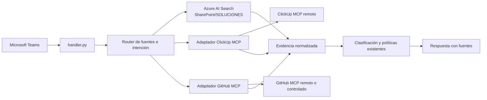

# Fase 2: implementación de ClickUp + GitHub mediante MCP

## Estado y decisión

**Plan aprobado con ajustes de seguridad y alcance.** Esta fase se ejecuta
después de cerrar la publicación controlada de Libras en Teams. No sustituye
Azure AI Search ni incorpora ClickUp o GitHub a su índice: las consultas a
estas fuentes serán directas, en tiempo real y mediante sus servidores MCP.

El App Service de Libras será el cliente MCP y conservará la responsabilidad
de decidir qué fuente consultar, transformar las respuestas en evidencia y
aplicar las reglas de seguridad existentes. El modelo no debe poder invocar
herramientas MCP arbitrarias.

## Objetivo

Permitir que Libras responda consultas operativas y técnicas con evidencia
trazable de fuentes autorizadas:

| Fuente | Aporta | No debe usarse para |
| --- | --- | --- |
| ClickUp MCP | Estado de tareas, incidentes, responsables, fechas y comentarios. | Confirmar que un cambio técnico fue aplicado. |
| GitHub MCP | Issues, pull requests, commits, archivos y ejecuciones autorizadas. | Inferir el estado operativo de una tarea sin respaldo ClickUp. |
| Azure AI Search / SharePoint | Manuales, procedimientos y documentación aprobada. | Indexar o reemplazar las consultas directas de ClickUp/GitHub en esta fase. |

Una relación entre una tarea ClickUp y un elemento de GitHub solo se
presentará como confirmada si existe una referencia verificable: URL, número
de issue/PR, rama, commit o identificador de tarea explícito.

## Arquitectura objetivo



La recuperación documental vigente no se modifica en su comportamiento:
`retrieval.py` seguirá consultando Azure AI Search para documentación
SharePoint. Se añadirá un router que active los adaptadores MCP únicamente
para consultas de estado, incidentes, cambios técnicos o referencias
explícitas a ClickUp/GitHub.

## Decisiones técnicas

1. Crear un cliente MCP común, con transporte HTTP, inicialización,
   descubrimiento validado de herramientas, timeouts, reintentos limitados y
   errores normalizados.
2. Implementar adaptadores separados para ClickUp y GitHub; ningún adaptador
   debe conocer detalles de Teams o de la generación de respuestas.
3. Usar una lista explícita de herramientas permitidas. No exponer al modelo
   las herramientas de creación, edición, comentario, merge, cierre o
   eliminación.
4. Operar inicialmente con identidades técnicas de solo lectura y alcance
   limitado. OAuth por usuario es una mejora posterior, porque implica flujo
   de autorización, callback, renovación y custodia de tokens por usuario.
5. Mantener una lista de Workspace/List de ClickUp y organización/repositorios
   GitHub autorizados. Toda referencia fuera de esa lista se rechaza antes de
   llamar al MCP.
6. Convertir resultados a `EvidenceSource`, preservando enlace original,
   sistema de origen, identificador estable, fecha de actualización y tipo de
   recurso.
7. Consultar GitHub solo cuando la pregunta lo requiera o ClickUp devuelva una
   referencia verificable; no hacer consultas cruzadas por defecto.

## Autenticación y permisos

### ClickUp

El MCP oficial de ClickUp usa OAuth. Para el piloto, la autorización debe
pertenecer a una cuenta técnica con acceso de lectura solo al Workspace y las
listas aprobadas. La aplicación debe conservar los tokens fuera del código y
renovarlos de manera segura.

### GitHub

Usar GitHub App, OAuth App o token técnico según el tipo de instancia
(`github.com`, Enterprise Cloud o Enterprise Server). Limitar la identidad a
los repositorios aprobados y habilitar solo herramientas de lectura. Si se
usa el servidor MCP oficial, configurar su modo de solo lectura y sus
toolsets/allowlist; además, comprobar este comportamiento con pruebas de
contrato antes de habilitarlo en producción.

### Custodia

- Guardar secretos y refresh tokens en Key Vault o almacén equivalente.
- Nunca escribir tokens, cabeceras HTTP, cuerpos completos o contenido
  sensible en logs.
- Registrar para auditoría: usuario Teams, fuente, herramienta permitida,
  recursos consultados, latencia, resultado y código de error seguro.
- Definir rotación, revocación y propietario operativo de cada identidad.

## Implementación propuesta

```text
src/
  mcp/
    client.py              # protocolo, transporte y errores comunes
    clickup_adapter.py     # consultas de solo lectura ClickUp
    github_adapter.py      # consultas de solo lectura GitHub
    correlation.py         # validación de vínculos ClickUp-GitHub
    evidence.py            # mapeo a EvidenceSource
  source_router.py         # selección de fuentes por intención
```

Cambios previstos en el backend actual:

- `config.py`: configuración no sensible, endpoints, límites y allowlists.
- `retrieval.py`: composición de evidencia documental y MCP, sin cambiar la
  recuperación de SharePoint.
- `handler.py`: retirar la respuesta fija de ClickUp no integrado y enrutar
  las nuevas consultas.
- `models.py`: ampliar metadatos de evidencia de forma compatible.
- `formatting.py`: citar fuente, enlace y nivel de relación confirmado o
  probable.
- `tests/`: pruebas unitarias, de contrato y de regresión del flujo actual.

El prototipo `src/planes_posteriores/clickup_retrieval.py` es solo referencia
funcional. No se incorporará tal cual porque usa REST directamente, consulta
una sola página de una lista y no tiene los controles MCP, paginación,
allowlists ni manejo de errores requeridos.

## Alcance del MVP

### Herramientas ClickUp permitidas

- Buscar tareas, listas, carpetas o documentos autorizados.
- Obtener detalle de tarea, estado, prioridad, responsables, fechas y
  comentarios permitidos.
- Abrir el enlace original de la tarea como fuente.

### Herramientas GitHub permitidas

- Buscar y leer Issues, pull requests, commits y archivos.
- Consultar revisiones y comentarios cuando correspondan al caso.
- Consultar ejecuciones de Actions solo si la pregunta trata de despliegue o
  fallo de CI/CD.

Quedan fuera del MVP todas las escrituras: crear/actualizar tareas, comentar,
crear ramas o pull requests, hacer merge, cerrar issues, ejecutar workflows,
eliminar recursos o modificar permisos.

## Correlación y respuesta

Orden de evidencia para relacionar ClickUp con GitHub:

1. URL GitHub explícita en la tarea ClickUp o URL ClickUp explícita en GitHub.
2. Identificador de issue o pull request explícito.
3. Rama, SHA de commit o identificador de tarea explícito.
4. Coincidencia textual: se muestra solamente como relación probable y nunca
   como prueba de resolución.

La respuesta debe separar las afirmaciones:

- **Estado operativo:** sustentado por ClickUp.
- **Cambio técnico:** sustentado por GitHub.
- **Procedimiento oficial:** sustentado por SharePoint/Azure AI Search.
- **Relación:** confirmada, probable o no verificada.

## Plan por entregables

1. **Accesos y contrato.** Confirmar Workspace/List, repositorios, modelo de
   identidad, preguntas piloto y permisos mínimos. Documentar herramientas
   MCP disponibles y permitir solo las necesarias.
2. **Cliente MCP común.** Implementar transporte, autenticación segura,
   límites, observabilidad, pruebas con fixtures y códigos de error.
3. **ClickUp.** Implementar búsqueda, detalle y normalización de evidencia;
   validar tareas inexistentes, permisos, paginación y límites de tasa.
4. **GitHub.** Implementar lectura de Issues, PRs, commits y archivos;
   validar solo lectura, scope de repositorio, permisos y límites de tasa.
5. **Correlación.** Implementar extracción y validación de referencias;
   probar relaciones confirmadas, probables y ausentes.
6. **Teams y regresión.** Ajustar intención, formato y ayuda; ejecutar toda
   la suite actual y pruebas end-to-end con evidencia real autorizada.
7. **Piloto controlado.** Medir latencia, precisión de correlación, errores y
   uso. Corregir hallazgos antes de ampliar usuarios o fuentes.

## Pruebas y criterios de aceptación

- Una consulta ClickUp devuelve evidencia con URL e identificador estable.
- Una consulta GitHub devuelve evidencia con URL e identificador estable.
- La aplicación no ofrece ni ejecuta operaciones de escritura.
- Un recurso fuera de allowlist no se consulta ni se muestra.
- Una falla o timeout de un MCP no afecta las consultas SharePoint vigentes.
- La correlación solo se marca confirmada cuando hay referencia verificable.
- Las respuestas sin evidencia declaran la limitación y no inventan estado,
  cambios ni vínculos.
- No hay secretos ni contenido sensible en logs.
- El conjunto de pruebas existente continúa pasando.
- Se validan preguntas reales del piloto desde Teams con las fuentes
  autorizadas.

## Dependencias que deben confirmarse antes de programar

1. Workspace, Spaces/Folders/Lists de ClickUp que estarán autorizados.
2. Organización y repositorios GitHub; confirmar además si es GitHub.com,
   Enterprise Cloud o Enterprise Server.
3. Cuenta técnica o aplicación propietaria de cada autorización y responsable
   de rotación.
4. Modelo de visibilidad: acceso común del piloto o OAuth individual por
   usuario.
5. Convención que vinculará ClickUp y GitHub: URL, identificador de tarea en
   rama/PR, etiqueta u otra regla que el equipo se comprometa a usar.
6. Casos de prueba reales y datos que no deben exponerse en Teams.

## Fuentes técnicas

- ClickUp MCP: <https://developer.clickup.com/docs/connect-an-ai-assistant-to-clickups-mcp-server-1>
- Herramientas ClickUp MCP: <https://developer.clickup.com/docs/mcp-tools>
- GitHub MCP Server: <https://github.com/github/github-mcp-server>
- Integración de host GitHub MCP: <https://github.com/github/github-mcp-server/blob/main/docs/host-integration.md>
