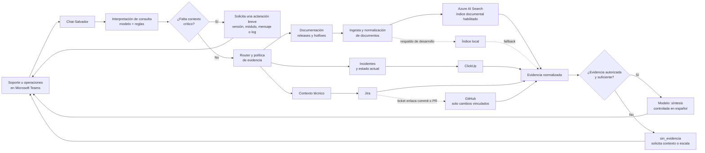
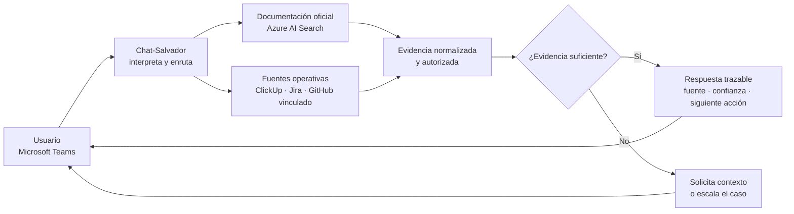
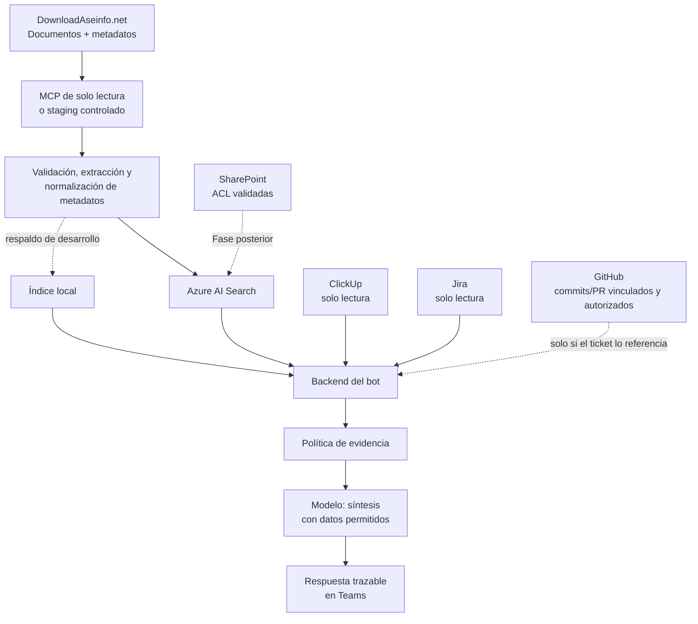

# Planificación ejecutiva — Chat-Salvador

> Documento breve para presentar la evolución del bot y alinear las decisiones de arquitectura, datos y operación. El detalle técnico y los criterios de aceptación se mantienen en `docs/plan-mvp-presentacion-lunes.md`.

## 1. Qué estamos construyendo

Chat-Salvador es un bot de Microsoft Teams para soporte y operaciones. Su función no es sustituir a desarrollo ni responder con suposiciones: encuentra evidencia en las fuentes autorizadas, la resume en español y muestra su procedencia, versión, fecha, enlace y siguiente acción.

El resultado esperado es que, ante preguntas como *«¿este error ya fue reportado?, ¿qué hotfix aplica?, ¿cómo se instala?»*, la persona pueda validar una respuesta trazable antes de escalar el caso.

El chat conserva un índice local de respaldo para desarrollo y demostración. Azure AI Search ya está habilitado como índice documental centralizado, sin obligar a rehacer Teams ni la lógica principal del bot.

### Diagrama resumido

> El bot no responde desde suposiciones: consulta la fuente apropiada, valida la evidencia y solo entonces entrega una respuesta o escala el caso.

## 2. Rol de cada componente

| Componente | Rol en la solución | Qué sí aporta | Límite importante |
|---|---|---|---|
| **DownloadAseinfo.net** | Fuente documental oficial de entregas. | Releases, instaladores, readmes, hotfixes, changelogs, versión, fecha y URL original. | No debe consultarse como sitio web en cada pregunta; alimenta un lote o índice preparado. |
| **Azure AI Search** | Índice documental centralizado habilitado. | Recuperación híbrida/semántica, filtros por producto, versión, fecha y tipo de documento; escalabilidad e integración natural con servicios Azure. | No crea conocimiento ni decide si un caso está resuelto; solo recupera documentos autorizados. |
| **Índice local** | Respaldo para desarrollo y demostración. | Permite probar cambios y mantener un fallback con un lote real aprobado. | No sustituye Azure AI Search como índice documental centralizado. |
| **Modelo de lenguaje (OpenAI)** | Intérprete y redactor, no fuente de verdad. | Cuando hace falta, identifica intención y datos faltantes; después resume exclusivamente la evidencia recuperada en una respuesta útil en español. | No selecciona libremente sistemas, no inventa tickets/versiones/soluciones y no puede declarar un estado que contradiga la política de evidencia. |
| **ClickUp** | Fuente operativa prioritaria. | Incidentes de QA/operación, texto del error, adjuntos autorizados y estado actual. | Acceso de solo lectura, limitado a listas autorizadas; una coincidencia no confirma por sí sola una solución. |
| **Jira** | Fuente complementaria e histórica. | Antecedentes técnicos, decisiones y seguimiento que no estén en ClickUp. | Solo proyectos autorizados y solo lectura; un ticket histórico no prueba que el problema actual siga resuelto. |
| **GitHub** | Evidencia técnica secundaria de cambios relacionados con un caso. | Repositorio, rama, commit/PR, fecha y diff para explicar qué se modificó en un hotfix o corrección. | Solo repositorios autorizados y commits/PR vinculados explícitamente a Jira o ClickUp; no indexa todo el código ni determina por sí solo el estado o la versión liberada de un incidente. |
| **SharePoint** | Fuente corporativa posterior. | Procedimientos, políticas y documentos que no viven en DownloadAseinfo.net. | Solo se incorpora tras validar biblioteca piloto, permisos por usuario/grupo y etiquetas de sensibilidad. |
| **Teams + backend actual** | Canal y orquestación. | Recibe la consulta, enruta a la fuente necesaria, aplica la política y entrega una respuesta consistente. | No se rehace para el MVP: se evoluciona la capa de recuperación. |

## 3. Principio de confianza

Cada fuente responde un tipo distinto de pregunta. Si hay conflicto, no se mezclan como si tuvieran la misma autoridad:

- **Instalación o versión:** prevalece el documento oficial de la versión exacta en DownloadAseinfo.net.
- **Estado actual de un incidente:** prevalece el ticket activo y autorizado más reciente, normalmente de ClickUp.
- **Antecedente o decisión técnica:** Jira aporta contexto, pero se presenta como antecedente si no confirma vigencia.
- **Cambio técnico de un hotfix:** GitHub puede explicar el diff o commit vinculado, pero no confirma por sí solo que la corrección fue liberada; la versión corregida debe estar respaldada por el ticket y/o release note.
- **Procedimiento corporativo:** SharePoint solo puede responder si el usuario conserva permiso de abrir el documento.
- **Sin evidencia suficiente o conflicto:** el bot responde `sin_evidencia` o `similar_del_pasado` y recomienda escalar; nunca afirma una solución.

## 4. Orden de implementación de las fuentes

| Fase | Fuente/capacidad | Por qué va en ese orden | Resultado verificable |
|---|---|---|---|
| **0. Base y seguridad** | Teams, contrato común de evidencia, Azure AI Search, índice local de respaldo, routing y política de decisión. | Es la base que permite integrar las fuentes sin cambiar la experiencia del usuario. | Una consulta desde Teams responde con fuente, fragmento y estado prudente usando un lote real aprobado. |
| **1. Documentación oficial** | DownloadAseinfo.net → staging controlado → Azure AI Search. | Es la fuente más estable y con mayor cobertura de releases, setups y hotfixes. Permite validar valor antes de depender de tickets o permisos complejos. | Búsqueda de un release/hotfix con versión, fecha, enlace y fragmento. Azure Search se compara con el respaldo local usando las mismas preguntas. |
| **2. Operación activa** | ClickUp de solo lectura. | Es la mejor fuente para saber si un error está reportado, en progreso o cerrado. Se agrega después de que la respuesta documental sea ya trazable. | Consulta de un error exacto que muestra ticket, estado y evidencia autorizada; no se modifica ninguna tarea. |
| **3. Contexto histórico y técnico** | Jira de solo lectura y GitHub acotado. | Jira complementa a ClickUp cuando falta el antecedente técnico; GitHub se consulta únicamente si el ticket autorizado enlaza un commit o PR relevante. Evita explorar código indiscriminadamente. | Consulta histórica con enlace al issue y, cuando exista vínculo autorizado, resumen técnico con repositorio, commit/PR, fecha y diff verificable. |
| **4. Conocimiento corporativo** | SharePoint, comenzando por una biblioteca piloto. | Tiene alta sensibilidad y exige gobierno de permisos. Se incorpora cuando se puede garantizar que el bot nunca entregue contenido que el usuario no pueda abrir. | Documentos de la biblioteca piloto indexados/consultados con ACL y enlace directo validados. |
| **5. Optimización y ampliación** | Sincronización incremental, telemetría y más bibliotecas/proyectos. | Solo después de medir calidad, frescura, uso y seguridad en el piloto. | Operación medible, actualización controlada y expansión aprobada por fuente. |

**Razón central del orden:** primero se resuelve la recuperación documental con contenido real y estable; después se añade el estado operativo de mayor frescura; por último se incorporan fuentes con mayor complejidad de permisos y sensibilidad. Así es posible demostrar valor aunque un conector, una credencial o un permiso todavía no esté disponible.

## 5. Flujo de datos propuesto

La ingesta está separada de la consulta: DownloadAseinfo.net actualiza el corpus; Azure AI Search e índice local sirven las preguntas. Esto reduce latencia, evita depender de la disponibilidad del portal y hace repetible la evaluación.

## 6. Qué se necesita para desarrollar y demostrar el MVP

### Accesos y decisiones de negocio

- Un lote pequeño de documentos **reales, aprobados y trazables** de DownloadAseinfo.net (idealmente releases, readmes y hotfixes de un producto piloto).
- Definir quién valida la precisión de las respuestas y qué equipo/grupo será piloto.
- Una lista autorizada de ClickUp y, si se usa, un proyecto autorizado de Jira; ambos con permiso de solo lectura.
- Repositorios autorizados de GitHub y una forma verificable de enlazar el ticket con su commit o pull request; GitHub no es requisito para una respuesta documental básica.
- Definir producto, módulos y preguntas reales para una matriz de al menos ocho casos de prueba.
- Confirmar la biblioteca piloto de SharePoint, pero sin bloquear el MVP por ella.

### Recursos y configuración técnica

- Entorno de Microsoft 365/Teams de desarrollo y registro del bot.
- Azure App Service, Azure Bot y una identidad administrada, que ya son parte de la base de infraestructura.
- Credenciales/secretos por entorno para OpenAI, ClickUp y Jira; nunca incluidos en código ni logs.
- Azure AI Search habilitado como índice documental central; el índice local mantiene el mismo contrato de evidencia como respaldo de desarrollo.
- Conector/MCP de DownloadAseinfo.net o, temporalmente, un staging controlado de documentos reales.
- Variables de configuración separadas para desarrollo, piloto y producción; validación explícita cuando falte una credencial.

### Trabajo de software previo a la demo

- Extraer proveedores de evidencia para documentos, Azure Search, ClickUp y Jira.
- Retirar la ruta heredada de OpenAI Vector Store del flujo de recuperación.
- Añadir metadatos de evidencia: sistema fuente, URL, versión, fecha, estado, confianza y, para GitHub cuando aplique, repositorio, rama y commit/PR.
- Implementar timeouts, errores por fuente, deduplicación y enlaces verificables.
- Aplicar política determinista: `resuelto`, `en_progreso`, `similar_del_pasado` o `sin_evidencia`.
- Probar resultados, ausencia de resultados, permisos ausentes y una fuente lenta/caída.

### 6.1 Hallazgos operativos de la llamada con Salvador

La llamada del 16 de julio aporta requisitos que no deben tratarse como detalles de UX, sino como condiciones de calidad del conocimiento:

- **El usuario no suele entregar evidencia recuperable.** Las capturas o fotografías sirven para reproducir, pero para investigar hacen falta el texto del mensaje, el log de Elmah u otro registro equivalente, además de producto, módulo, versión y flujo afectado.
- **Las consultas se agrupan en cuatro familias:** error repetitivo con mensaje exacto; comportamiento extraño que se busca por módulo/acción/palabra humana; validación o configuración que el usuario llama “error”; y preguntas de instalación, personalización, tablas o procedimientos que requieren contexto de versión y, a veces, código autorizado.
- **El buscador debe aceptar lenguaje humano y sinónimos**, no exigir que Operaciones conozca nombres internos como UPF, Elmah, parámetros o componentes técnicos. La ruta debe conservar la consulta original y pedir el dato mínimo faltante.
- **ClickUp contiene copias y recorridos distintos del mismo caso** (incidente, feedback y backlog de Evolution). Mover un caso puede romper la retroalimentación para quien lo reportó. El modelo de evidencia debe enlazar registros relacionados y mantener un identificador canónico, en vez de deduplicar únicamente por fuente e identificador.
- **El estado operativo necesita más detalle que abierto/cerrado:** reportado, en investigación, no se trabajará, resuelto con versión/acción, o antecedente. “Resuelto” exige una corrección o workaround verificable; un clon cerrado sin esa información no basta.
- **Existe una dependencia humana concreta:** Salvador es hoy un referente funcional que documenta, busca antecedentes y ayuda a resolver dudas de Operaciones y Soporte. El MVP debe capturar su conocimiento mediante una matriz de preguntas reales, revisión de respuestas y un proceso de corrección; no debe asumir que toda la base está documentada.
- **El valor debe medirse contra repetición real.** En la llamada se menciona un mismo problema consultado aproximadamente 50 veces. Conviene registrar preguntas repetidas, consultas evitadas y casos que siguen requiriendo escalamiento.

Estos hallazgos justifican un piloto con reglas de calidad de entrada, búsqueda por síntoma y estado, y una ruta explícita de escalamiento para configuración, instalaciones y personalizaciones no documentadas.

### 6.2 Casos prioritarios para evaluar el MVP

La primera matriz de pruebas debe concentrarse en los siguientes resultados, formulados como preguntas reales y comprobables. Los casos de base de datos y comparación contra instalaciones de clientes se mantienen fuera del MVP inicial porque requieren acceso y gobierno adicionales.

| Prioridad | Capacidad a demostrar | Pregunta representativa | Evidencia mínima esperada |
|---|---|---|---|
| **P0** | Encontrar un incidente aunque cambie el vocabulario del síntoma. | “Al subir un adjunto aparece `Content-Disposition`. ¿Es conocido, qué versiones afecta y en cuál se corrigió?” | Ticket o registros relacionados, estado, versiones afectadas y versión del fix solo si está documentada; sinónimos como UPF, adjuntos o Plus File. |
| **P0** | Reconocer un síntoma sin exigir el error exacto. | “Evolution no me permite cargar archivos adjuntos. ¿Ya está reportado o cómo lo soluciono?” | Coincidencias relevantes; si no se puede confirmar, solicitud de versión y log/mensaje exacto. |
| **P0** | Buscar por concepto funcional y relacionar registros. | “El ingreso eventual no aplica el valor gradual/porcentual. ¿Existe un incidente y en qué versión quedó resuelto?” | Relación visible entre incidente, feedback o ticket de desarrollo; estado y versión verificable si existen. |
| **P0** | Distinguir estado actual de una corrección confirmada. | “¿En qué estado está el incidente de ingreso eventual y dónde se corrigió?” | Ticket fuente, estado actual y release/hotfix o commit vinculado cuando exista; `sin_evidencia` si falta confirmación. |
| **P0** | Separar una validación de un defecto. | “Me aparece en rojo que debo adjuntar un archivo al guardar una acción. ¿Es un error?” | Explicación de la regla o validación documentada y datos faltantes antes de diagnosticar una falla. |
| **P0** | Guiar el escalamiento con evidencia insuficiente. | “Tengo este problema, pero solo cuento con una foto de la pantalla. ¿Qué necesitan para investigarlo?” | Solicitud de versión, pasos, mensaje exacto y logs; explicación de que la imagen sola no suele confirmar un incidente. |

GitHub solo participa en estos casos cuando aporte un enlace explícito entre un ticket y un cambio técnico. Para el MVP no es una condición para afirmar que un incidente existe, está resuelto o fue liberado.

## 7. Qué se necesita para pasar a producción

La producción no es solo desplegar el bot. Se recomienda habilitarla después de un piloto con resultados revisados y los siguientes controles:

| Área | Condición mínima de producción |
|---|---|
| **Calidad** | Matriz de casos reales validada; respuestas trazables; ningún caso aceptable de versión, ticket o solución inventada; criterio de escalamiento validado. |
| **Datos** | Propietario por fuente, proceso de actualización, metadatos de versión/fecha, eliminación de documentos obsoletos y sincronización incremental controlada. |
| **Seguridad** | Secretos en Key Vault o equivalente, identidades administradas, mínimo privilegio, acceso solo lectura y revisión de enlaces/adjuntos. |
| **SharePoint y documentos sensibles** | ACL por usuario o grupo probadas de extremo a extremo: el bot no muestra contenido que el usuario no pueda abrir en origen. |
| **Operación** | Separación dev/piloto/prod, Application Insights o telemetría equivalente, alertas de errores/latencia y trazabilidad sin exponer secretos ni datos sensibles. |
| **Rendimiento y resiliencia** | Límites de tiempo por fuente, respuesta parcial cuando una fuente falla, fallback documental y pruebas de carga acordes al grupo piloto. |
| **Gobierno** | Dueños funcionales, proceso de feedback/corrección, catálogo de fuentes autorizadas, retención de logs y procedimiento de incidentes. |
| **Despliegue** | Infraestructura como código (Bicep), revisión de seguridad, aprobación del tenant y plan de reversión. |

## 8. Hitos de decisión

1. **MVP demostrable:** Teams + lote real + Azure AI Search + evidencia y escalamiento; ClickUp se muestra si está disponible, sin fingir resultados si no lo está.
2. **Piloto controlado:** Azure AI Search, ClickUp y Jira operando con permisos delimitados; GitHub se usa únicamente para cambios vinculados y autorizados. Se mide utilidad, calidad, latencia y vacíos documentales.
3. **Preparación productiva:** sincronización, observabilidad, controles de acceso y gobierno de contenido validados.
4. **Producción:** ampliación gradual de usuarios y fuentes según resultados del piloto, nunca indexando masivamente contenido sensible sin permiso y trazabilidad.

## 9. Mensaje sugerido para exponer la planificación

> No estamos construyendo otro chat genérico. Estamos creando un punto de consulta trazable para soporte y operaciones. Azure AI Search ya centraliza la búsqueda documental y el índice local queda como respaldo de desarrollo. DownloadAseinfo.net aporta la documentación oficial; ClickUp muestra incidentes y su estado; Jira aporta antecedentes técnicos; GitHub explica cambios concretos solo cuando estén vinculados a un ticket autorizado; y SharePoint se agregará cuando sus permisos estén validados. El modelo solo interpreta y resume la evidencia: no inventa respuestas ni decide por sí mismo. Empezamos por documentación real y estable, luego añadimos el estado operativo y el enriquecimiento técnico controlado. Así podemos demostrar valor desde el MVP y llegar a producción con datos, permisos y operación controlados.

**Énfasis recomendado para el lunes:** la llamada con Salvador muestra que el problema actual también es de documentación y calidad del reporte. El bot debe enseñar qué información falta (versión, módulo, mensaje/log y flujo), distinguir un error de una validación o configuración, y relacionar el mismo caso cuando aparece en incidente, feedback y backlog. Salvador puede actuar inicialmente como validador funcional y dueño del catálogo de preguntas recurrentes; el objetivo es convertir ese conocimiento tácito en evidencia reutilizable, no sustituirlo sin controles.
